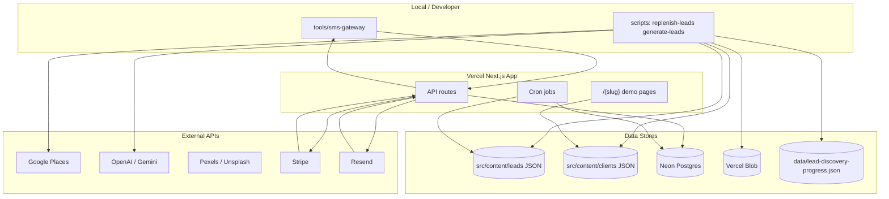
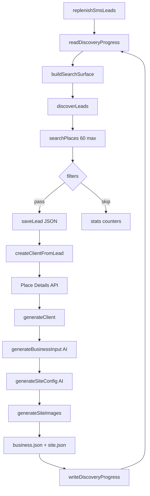
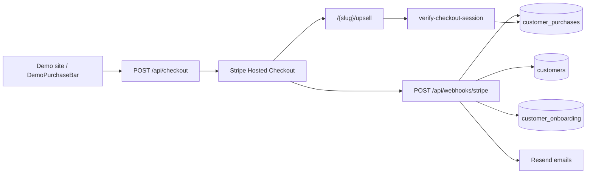

# Architecture Report

**Project:** `ai-websites` (zbrendiraj.si demo-site factory)  
**Generated from:** live codebase inspection (August 2026)  
**Stack:** Next.js 16 App Router, React 19, TypeScript, Tailwind 4, Vercel

This document describes **implemented behavior** in the repository. Where legacy or dormant code exists, it is called out explicitly.

For **cost per demo, cache/reuse gaps, failure modes at scale, and prioritized optimizations**, see [FACTORY-COST-RELIABILITY-AUDIT.md](./FACTORY-COST-RELIABILITY-AUDIT.md).

---

## 1. High-level architecture

### Next.js structure

The app uses the **App Router** exclusively under `src/app/`. There is no `pages/` router.

| Area | Path | Role |
|------|------|------|
| Public client sites | `src/app/[slug]/` | Per-demo/customer pages (hero, services, pricing, gallery, contact) |
| Marketing / product site | `src/content/clients/zbrendiraj-si/` + appearance `zbrendiraj` | Product landing with Stripe pricing table |
| Admin | `src/app/admin/` | Lead pipeline, outreach, onboarding review (cookie auth) |
| API | `src/app/api/` | Checkout, webhooks, cron, SMS gateway, contact, onboarding |
| Shared renderer | `src/app/site-page.tsx` | Resolves appearance, theme CSS vars, purchase/customer chrome |

**Routing & domains** (`src/middleware.ts`, `src/lib/custom-domains.ts`):

- `/demo/{slug}` → rewrite to `/{slug}`
- Custom domains (e.g. `zbrendiraj.si`) rewrite legal paths to `/{slug}/*`
- `splet.vercel.app` → redirect to `https://zbrendiraj.si`
- `/admin/*` protected by `admin_session` cookie matching `ADMIN_SECRET`

**Static generation:** `src/app/[slug]/page.tsx` exports `generateStaticParams()` from `siteSlugs` (`src/content/sites/index.ts` = union of `clientSlugs` + legacy `src/content/sites/*.json`). The same page also sets `dynamic = "force-dynamic"`, so runtime behavior is dynamic-capable while build pre-renders known slugs.

### Frontend / backend split

| Layer | Technology | Notes |
|-------|------------|-------|
| UI | React 19 + Tailwind 4 | Appearance-specific page components in `src/appearances/` |
| Server components | Next.js RSC | `SitePage`, admin pages, metadata |
| API routes | Route handlers in `src/app/api/` | Node runtime for Stripe, DB, file I/O |
| CLI / batch | `scripts/*.ts` via `tsx` | Lead discovery, generation, backfills (excluded from `tsconfig` bundle) |
| Local SMS daemon | `tools/sms-gateway/` | Separate Node process; polls Vercel API |

There is **no separate backend service**. Business logic lives in `src/` modules imported by API routes and scripts.

### Vercel deployment

- **Hosting:** Vercel (inferred from `@vercel/blob`, OIDC blob auth, `vercel.json`, middleware redirects)
- **Crons** (`vercel.json`):
  - `GET /api/cron/sms-outreach` — daily 09:00 UTC (enqueue SMS batch)
  - `GET /api/cron/replenish-leads` — daily 06:00 UTC (**status only**, no discovery/generation)
- **Images:** Remote patterns for `*.blob.vercel-storage.com` in `next.config.ts`
- **Build:** `next build` with React Compiler enabled

**Important operational constraint:** Lead discovery and demo generation write to `src/content/` on disk. The replenish cron explicitly documents that Vercel filesystem is ephemeral — **full replenish runs locally** via `npm run replenish-leads`, then commits.

### GitHub / environment configuration

- **Repo:** GitHub (`origin/main`); no CI workflows found in repo
- **Secrets:** `.env*` gitignored; loaded locally via `dotenv` in scripts (`scripts/replenish-leads.ts`, etc.)
- **Env docs:** `docs/CHECKOUT.md`, `docs/OUTREACH.md`, `docs/SMS_OUTREACH.md`, `docs/ONBOARDING.md`
- **No committed `.env.example`** — env vars must be inferred from code references

Primary public URL resolution: `src/site-url.ts` (`SITE_URL` → `NEXT_PUBLIC_SITE_URL` → Vercel URL fallback).

---

## 2. Lead discovery pipeline

### Overview

Lead discovery feeds the SMS sales pipeline. The **current production path** is the **region × profession discovery matrix** driven by `replenishSmsLeads()` in `src/leads/replenish.ts`. Legacy ICP slot rotation (`src/leads/icp.ts`, `src/leads/slot-yield.ts`) **still exists but is not imported by replenish**.

### Discovery matrix

| Module | Path | Role |
|--------|------|------|
| Matrix surface | `src/leads/discovery-matrix.ts` | `buildSearchSurface(regionId, professionId)` |
| Regions | `src/leads/discovery-regions.ts` | 12 SURS statistical regions, towns, address regex, location bias |
| Professions | `src/leads/discovery-professions.ts` | 16 image-pool-aligned professions, `googleTerm`, match/exclude patterns |
| Progress | `src/leads/discovery-progress.ts` | Persistent state in `data/lead-discovery-progress.json` |
| Config | `src/leads/discovery-config.ts` | Limits: 60 places/query, 80 searches/run, zero-yield streak 3 |
| Orchestrator | `src/leads/replenish.ts` | Matrix loop + demo generation |
| CLI | `scripts/replenish-leads.ts` | Run, `--status`, `--reset --confirm` |

**Dimensions:** 12 regions × 16 professions = **192 combinations**.

**Region order** (density-first): Osrednjeslovenska → Podravska → Gorenjska → remaining 9 SURS regions (`DISCOVERY_REGION_ORDER` in `discovery-regions.ts`).

**Profession order:** Same as `IMAGE_POOL_CATEGORY_IDS` in `src/images/image-pool-category.ts` (nohti-pedikura through cistilni-servisi).

**Query surface per cell** (`buildSearchSurface`):

1. `{googleTerm} {region.name}` (regional)
2. `{googleTerm} {town}` for each town in region (stable order)
3. Optional extra terms from `profession.extraQueryTerms` (region + first 3 towns)

### Google Places API

| Module | Path | Role |
|--------|------|------|
| Places client | `src/sources/google-places-source.ts` | Text Search + pagination + Place Details |
| Discovery entry | `src/leads/discover.ts` | Filter, dedupe, save leads |

**Discovery search:**

- `searchPlaces(query, limit, { locationBias })` — up to **60 results** (3 pages × 20), **2s delay** between pages
- Field mask for discovery: id, name, type, phone, address, website, rating, reviewCount (no reviews/hours)
- API key: `GOOGLE_PLACES_API_KEY`

**Generation-time details:** `createPlaceDetailsSource(googlePlaceId)` fetches fuller details when building a demo (`src/clients/create-client-from-lead.ts`).

### Filtering and deduplication

Applied in `discoverLeads()` (`src/leads/discover.ts`) in order:

1. **Place ID dedup** — skip if `googlePlaceId` already in `src/content/leads/*.json`
2. **Region** — `matchesRegion()` via `src/leads/region.ts` (legacy notranjska/dolenjska OR discovery region address patterns)
3. **Website** — skip if `withoutWebsiteOnly` and business has website
4. **Mobile phone** — `isSlovenianMobilePhone()` when `requireMobilePhone: true`
5. **Profession** — `professionMatchesBusiness()` + `ICP_EXCLUDE_NAME_PATTERN` (hospitality/retail noise)
6. **Slug** — must produce usable slug from company name

Replenish post-filters discovered leads again with `isSmsGenerationCandidate()`, `classifyRejectReason()`, and `clientSiteExists()`.

### Progress persistence

**File:** `data/lead-discovery-progress.json` (gitignored)

**Schema (`DiscoveryProgress` v1):** frozen region/profession order, current pointer, per-combination stats (`queriesCompleted`, `zeroYieldStreak`, rejection counters, etc.).

**Completion rules per cell:**

- All high-value queries completed, OR
- `zeroYieldStreak >= DISCOVERY_ZERO_YIELD_COMPLETION_STREAK` (default 3), OR
- No queries remaining

**Query dedup:** Completed queries are never re-run across process restarts.

### Replenish-leads flow

```
npm run replenish-leads
  → replenishSmsLeads()
  → countActionableSmsLeads() vs SMS_LEAD_TARGET (500) / batch (100)
  → loop while demosGenerated < toGenerate AND searches < 80:
      readDiscoveryProgress()
      findActiveCombination() → build/activate surface → next query
      discoverLeads(query, 60, { profession, region, requireMobilePhone, withoutWebsiteOnly })
      for each discovered:
        createClientFromLead(slug) → generateClient()
      markQueryCompleted + writeDiscoveryProgress()
```

**Stop reasons:** `target_met`, `global_search_limit`, `all_combinations_exhausted`.

### Exact flow: query → candidate → actionable lead


| Stage | Definition | Where checked |
|-------|------------|---------------|
| **Query** | `{googleTerm} {region\|town}` from matrix | `discovery-matrix.ts` |
| **Raw place** | Google Places result | `google-places-source.ts` |
| **Candidate / discovered lead** | Saved to `src/content/leads/{slug}.json`, status `discovered` | `discover.ts` + `store.ts` |
| **Demo generated** | `src/content/clients/{slug}/site.json` exists | `create-client-from-lead.ts` |
| **SMS generation candidate** | No website + Slovenian mobile | `isSmsGenerationCandidate()` |
| **Relevant SMS lead** | Generation candidate + demo exists + demo URL | `isRelevantSmsLead()` |
| **Actionable SMS lead** | Relevant + not customer + not SMS opted out | `isActionableSmsLead()` |

**Manual discovery path:** `npm run discover-leads` → `scripts/discover-leads.ts` uses legacy `industry` option and `LeadIndustryId` filtering (not the matrix).

---

## 3. AI generation pipeline

### Providers and models

| Step | Provider switch | Model | File |
|------|-----------------|-------|------|
| Raw → BusinessInput | `AI_PROVIDER` (`openai` default) | OpenAI: `gpt-4.1-mini` | `src/ai/providers/generate-business-input/openai.ts` |
| Raw → BusinessInput | `AI_PROVIDER=gemini` | Gemini: `gemini-3.5-flash-lite` | `src/ai/providers/generate-business-input/gemini.ts` |
| BusinessInput → SiteConfig | same | same | `src/ai/providers/openai.ts`, `src/ai/providers/gemini.ts` |
| Image search plan | **Always Gemini** | `gemini-3.5-flash-lite` | `src/images/build-search-queries.ts` |

Provider selection: `src/ai/providers/index.ts`, `src/ai/providers/generate-business-input/index.ts`.

### Gemini rate limiting and retry

**Module:** `src/ai/gemini-request.ts`

All Gemini `generateContent` calls go through `generateGeminiContent()`:

- **Proactive throttle:** serial queue, min **4100ms** between requests (`GEMINI_MIN_REQUEST_INTERVAL_MS`)
- **429 retry:** up to **3** attempts (`GEMINI_MAX_429_RETRIES`), parses `RetryInfo.retryDelay` or falls back to 60s + jitter
- **Call sites:** both Gemini providers + `build-search-queries.ts`

OpenAI has **no equivalent centralized rate limiter** in this repo.

### Generation → validation → normalization

**Orchestrator:** `src/clients/generate-client.ts`

```
validateRawBusinessData(raw)
  → generateBusinessInput()     [AI + validation retry]
  → generateSiteConfig()        [AI + validation retry]
  → appearanceForIndustry()     [regex → appearance id]
  → assignBeautyLayout / assignTradeLayout / assignTheme
  → generateSiteImages()        [Gemini plan + pool or stock download]
  → applyNewLeadSectionDefaults()
  → validateSiteConfig()
  → write business.json, site.json, update lead status
```

**Validation chain for AI SiteConfig** (`src/ai/providers/prompt.ts` → `parseAndValidateSiteConfig`):

1. JSON parse + fence stripping
2. **`normalizeGallerySection()`** — fill missing `gallery.eyebrow`/`title` before schema ( `src/content/apply-new-lead-sections.ts` )
3. `validateSiteConfig()` — Zod schema (`src/content/validate-site-config.ts`)
4. `validateGeneratedSiteConfig()` — section counts, pricing required, copy length (`src/ai/validate-generated-site-config.ts`)
5. `validateClaims()` — factual claim guardrails (`src/ai/validate-claims.ts`)

**BusinessInput validation:** `src/ai/validate-business-input.ts` (Zod).

### Content correction retries

**Module:** `src/ai/generation-error.ts`

- Only `GenerationContentError` is **retryable** (bad JSON, schema, unsupported claims)
- `generateBusinessInput` and `generateSiteConfig` retry **once** with correction message appended to prompt
- Transport errors (401, 429, missing API key) are **not** retried at this layer (429 on Gemini is handled inside `gemini-request.ts` before surfacing)

### Failure and error handling

| Context | Behavior | File |
|---------|----------|------|
| Batch scripts (`generate-leads`, `generate-batch`) | `isFatalGenerationError()` stops batch on 401/429/missing key | `src/clients/fatal-error.ts` |
| Replenish loop | Per-lead errors logged; run continues | `src/leads/replenish.ts` |
| Image generation | Failures → warning, placeholders kept | `src/images/generate-site-images.ts` |
| Stripe webhook | Handler error → 500 (Stripe retries) | `src/app/api/webhooks/stripe/route.ts` |

---

## 4. Website / demo generation

### Lead → client artifact flow

| Step | Input | Output | Module |
|------|-------|--------|--------|
| Discover | Places result | `src/content/leads/{slug}.json` | `discover.ts`, `store.ts` |
| Generate | Lead + Place Details | `src/content/clients/{slug}/business.json` | `generate-client.ts` |
| Generate | AI output | `src/content/clients/{slug}/site.json` | `generate-client.ts` |
| Images | Stock/pool | URLs in `site.json` `images` + Blob/local files | `generate-site-images.ts` |

**Lead record fields:** slug, googlePlaceId, companyName, phone, address, ratings, existingWebsite, status, sourceQuery.

**business.json:** normalized `BusinessInput` (company-facing fields for AI and onboarding).

**site.json:** full `SiteConfig` (sections, theme, layout, images, pricing, gallery flags).

### Template architecture

Not a single HTML template — **appearance registry** pattern:

| Appearance | Component | Typical industries |
|------------|-----------|-------------------|
| `default` | `DefaultSitePage` | Fallback |
| `beauty` | `BeautySitePage` | Hair, nails, cosmetics |
| `health` | `TradeSitePage` | Massage, wellness |
| `auto` | `TradeSitePage` | Auto repair, body shops |
| `elektro`, `construction`, `cleaning` | `TradeSitePage` | Trades |
| `zbrendiraj` | `ZbrendirajSitePage` | Product marketing site |

- Registry: `src/appearances/registry.ts`
- Industry → appearance: `src/appearances/industry-appearance.ts` (keyword regex)
- Layout variants: `src/appearances/beauty/assign-layout.ts`, `src/appearances/trade/assign-layout.ts`
- Theme/palette: `src/theme/assign-theme.ts`, `src/theme/palettes.ts`
- Sections: shared components in `src/components/sections/` (Hero, Services, Gallery, Pricing, Contact, etc.)

Post-AI defaults for new leads: `applyNewLeadSectionDefaults()` enables gallery/pricing section flags, empty gallery items, pricing disclaimer, nav links.

### Static vs generated content

| Type | Location | Committed to git |
|------|----------|------------------|
| Legacy static sites | `src/content/sites/*.json` | Yes (e.g. templates) |
| Generated demos | `src/content/clients/{slug}/` | Yes (primary demo corpus) |
| Lead metadata | `src/content/leads/{slug}.json` | Yes |
| Optimized images | Vercel Blob / `public/clients/` | Blob in prod; local avif/webp gitignored |
| Runtime DB | Neon Postgres | Not in repo |

Site configs are loaded at build/runtime via webpack `require.context` in `src/content/get-site-config.ts`.

### Publishing and serving

1. **Build:** `generateStaticParams()` pre-renders all slugs in `siteSlugs`
2. **Runtime:** `GET /{slug}` → `getSiteConfig(slug)` → `SitePage` → appearance `Page` component
3. **Demo mode:** `DemoPurchaseBar` shown when not a paying customer (`src/billing/DemoPurchaseBar.tsx`)
4. **Customer mode:** After Stripe checkout, `CustomerPreparingBar` + onboarding URL (`src/onboarding/customer-chrome.ts`)
5. **Custom domain:** middleware rewrite to slug-specific legal pages

Demos are **not deployed separately** — they are routes in the same Next.js app on Vercel.

---

## 5. Image pipeline

### Flow

`generateSiteImages()` in `src/images/generate-site-images.ts`:

1. Require `PEXELS_API_KEY` and/or `UNSPLASH_ACCESS_KEY`
2. **`buildImageSearchPlan()`** — Gemini generates hero/services English queries + Slovenian alt text
3. **`resolveImagePoolCategory()`** — regex match on industry/company name
4. **Pool path:** `generateImagesFromPool()` — reuse cached assets by category
5. **Fallback:** `downloadStockPhoto()` — Pexels first, then Unsplash

### Pexels / Unsplash

| Provider | Module | Used for |
|----------|--------|----------|
| Pexels | `src/images/providers/pexels.ts` | Primary search, **pool fill** |
| Unsplash | `src/images/providers/unsplash.ts` | Fallback direct download only |

**Unsplash rate limit:** `src/images/unsplash-rate-limit.ts` — 45 searches/hour, file-backed `data/.unsplash-search-times.json`; skips if wait > 15s.

**Pexels:** 403/429 → single 5s retry then skip.

### Image pool

| Module | Role |
|--------|------|
| `src/images/image-pool-category.ts` | 16 category IDs + match regexes (shared with discovery professions) |
| `src/images/image-pool-queries.ts` | Static Pexels query lists per category |
| `src/images/image-pool-config.ts` | POOL_TARGET=30, INITIAL_FILL=10, MAX_IMAGE_USES=40 |
| `src/images/image-pool.ts` | Fill, select, assign, replenish pool |
| `src/images/asset-cache.ts` | Persistent cache metadata |

**Selection:** lowest `usageCount`, slug-hash rotation for fairness.

### Download, conversion, storage

| Step | Module | Detail |
|------|--------|--------|
| Download | `src/images/download-stock-photo.ts` | Provider APIs → candidate buffer |
| Optimize | `src/images/optimize-image.ts` | Sharp: hero 1600×2400, services 1400×1400; AVIF + WebP |
| Persist stock | `src/images/storage.ts` | Dedupe path `stock/{provider}/{id}.{avif,webp}` |
| Persist client | `src/images/storage.ts` | `clients/{slug}/{slot}.{avif,webp}` |
| Blob vs local | `storage.ts` | Vercel Blob (OIDC or `BLOB_READ_WRITE_TOKEN`); local fallback `public/` |

### Attribution

Stored per `SiteImage` in `site.json`: `provider`, `sourceId`, `sourceUrl`, `photographer`, `photographerUrl`, `searchQuery`.

### Caching

- **Asset metadata:** `data/image-asset-cache.json` (gitignored, override via `IMAGE_ASSET_CACHE_PATH`)
- **Usage counts:** seeded from existing client `site.json` images on read
- **Unsplash throttle log:** `data/.unsplash-search-times.json` (gitignored)

---

## 6. Customer / payment architecture

### Stripe Checkout

| Route | Purpose |
|-------|---------|
| `POST /api/checkout` | Base subscription checkout (monthly/yearly) |
| `POST /api/checkout/upsell` | Post-purchase upsells |

**Module:** `src/billing/stripe.ts` — price IDs from env (`STRIPE_PRICE_MONTHLY`, `STRIPE_PRICE_YEARLY`, upsell prices).

**Flow:** Demo site → `DemoPurchaseBar` → Stripe hosted checkout → success redirect to `/{slug}/upsell?session_id=...`.

### Subscriptions and upsells

- **Base plan:** Stripe subscription mode; metadata includes `slug`, `plan`
- **Upsells** (`src/billing/upsells.ts`): `google_business`, `seo` (one-time payment), `professional_email` (subscription)
- **Upsell UI:** `src/app/[slug]/upsell/page.tsx`

### Webhooks

**Route:** `POST /api/webhooks/stripe/route.ts`

- Verifies signature via `STRIPE_WEBHOOK_SECRET`
- Handles `checkout.session.completed` only
- Writes `customers`, `customer_purchases`, triggers onboarding + emails
- Returns 500 on handler failure (Stripe retries)

**Redirect-side confirmation:** `src/billing/verify-checkout-session.ts` backfills if webhook lags.

### Neon / Postgres

| Module | Role |
|--------|------|
| `src/db/client.ts` | `@neondatabase/serverless` |
| `src/db/schema.ts` | DDL as TS strings (bundled for Vercel) |
| `src/db/ensure-schema.ts` | Auto-bootstrap on cold start |

**Tables:** `customers`, `customer_purchases`, `customer_onboarding`, `sms_messages`, `sms_lead_state`, `sms_inbound`.

Leads remain **JSON files**, not in Postgres.

### Idempotency

| Mechanism | Detail |
|-----------|--------|
| `customer_purchases.stripe_checkout_session_id` UNIQUE | `ON CONFLICT DO NOTHING` |
| `(slug, upsell_type)` partial unique | One upsell type per customer |
| Webhook | Skip duplicate emails if `alreadyProcessed` |
| Upsell API | 409 if already purchased |

---

## 7. Email / communication

### Resend

**Core sender:** `src/outreach/resend.ts` (retries for outreach)

| Channel | Trigger | Module |
|---------|---------|--------|
| Lead outreach (manual) | Admin API | `src/outreach/send.ts` |
| Checkout notification | Stripe webhook | `src/billing/notify.ts` |
| Customer welcome | Stripe webhook | `src/billing/notify-onboarding-customer.ts` |
| Onboarding approved | Admin approve | `src/billing/notify-onboarding-approved.ts` |
| Contact form | `POST /api/contact` | `src/contact/send-email.ts` |

**Automated email cron:** `src/app/api/cron/outreach/route.ts` exists but automated outreach is **SMS-only** per product direction.

**Resend webhook:** `POST /api/webhooks/resend/route.ts` — Svix verification (optional if secret unset); updates lead JSON outreach delivery state.

### Contact forms

- UI: `src/components/contact/ContactForm.tsx`
- API: `src/app/api/contact/route.ts` — Zod validation, **in-memory IP rate limit (5/min)**, sends to `siteConfig.business.email` via Resend
- No DB persistence

### SMS outreach

**Architecture:** Vercel enqueues → local `tools/sms-gateway/` polls and sends via Huawei modem.

| Route | Role |
|-------|------|
| `GET /api/cron/sms-outreach` | Daily enqueue eligible leads |
| `GET /api/outreach/sms/queue` | Gateway claims messages |
| `POST /api/outreach/sms/result` | Delivery result |
| `POST /api/outreach/sms/inbound` | Inbound SMS + opt-out |

**Auth:** Bearer `SMS_GATEWAY_SECRET` / `CRON_SECRET` / `ADMIN_SECRET` (`src/lib/auth.ts`).

**Eligibility:** `src/outreach/sms/eligibility.ts` — separate from pipeline “relevance” checks.

**Docs:** `docs/SMS_OUTREACH.md`, `tools/sms-gateway/README.md`

---

## 8. Data architecture

### Important directories

| Path | Purpose | Source of truth? |
|------|---------|------------------|
| `src/content/leads/` | Lead records (JSON) | Yes (lead pipeline) |
| `src/content/clients/{slug}/` | Demo/customer site configs | Yes (published demos) |
| `src/content/sites/` | Legacy single-file sites | Yes (few legacy slugs) |
| `src/appearances/` | UI templates by industry | Yes (code) |
| `src/leads/` | Discovery + lead logic | Yes (code) |
| `src/ai/` | AI providers, validation | Yes (code) |
| `src/images/` | Image pool, providers | Yes (code) |
| `src/billing/`, `src/customers/` | Payments | Code + Postgres |
| `src/outreach/` | Email + SMS | Code + Postgres for SMS |
| `data/` | Runtime caches, progress | Generated (mostly gitignored) |
| `scripts/` | CLI tools | Code |
| `tools/sms-gateway/` | Local SMS daemon | Code |
| `docs/` | Human documentation | Docs (may drift from code) |

### Generated / persistent runtime state

| File | Gitignored | Purpose |
|------|------------|---------|
| `data/lead-discovery-progress.json` | Yes | Matrix discovery progress |
| `data/image-asset-cache.json` | Yes | Stock image pool metadata |
| `data/.unsplash-search-times.json` | Yes | Unsplash hourly throttle |
| `data/replenish-cursor.json` | Yes | Legacy ICP cursor (unused by matrix) |
| `data/replenish-slot-yield.json` | Yes | Legacy slot yield (unused by matrix) |
| `public/stock/`, `public/clients/**/*.avif/webp` | Yes | Local image fallbacks |
| `.env*` | Yes | Secrets |
| Postgres (Neon) | N/A | Customers, purchases, SMS, onboarding |

### Database schema summary

See `src/db/schema.ts` — customers, purchases, onboarding, SMS tables with unique indexes for idempotency. Schema applied idempotently via `ensureCustomerSchema()` / `ensureSmsSchema()`.

---

## 9. External services

| Service | Purpose | Where used | API / credential | Failure impact |
|---------|---------|------------|------------------|----------------|
| **Google Places API** | Lead discovery, place details | `google-places-source.ts`, `discover.ts` | `GOOGLE_PLACES_API_KEY` | No new leads; discovery stops |
| **OpenAI API** | BusinessInput + SiteConfig (default) | `src/ai/providers/openai.ts` | `OPENAI_API_KEY`, `AI_PROVIDER=openai` | Demo generation fails |
| **Google Gemini API** | SiteConfig/business (optional) + image search plans | `gemini.ts`, `build-search-queries.ts`, `gemini-request.ts` | `GEMINI_API_KEY` | Generation fails if gemini provider; image plan always needs Gemini |
| **Pexels API** | Stock photos, pool fill | `src/images/providers/pexels.ts` | `PEXELS_API_KEY` | Pool/fallback images missing |
| **Unsplash API** | Stock photo fallback | `src/images/providers/unsplash.ts` | `UNSPLASH_ACCESS_KEY` | Fallback path degraded |
| **Vercel Blob** | Image hosting (prod) | `src/images/storage.ts` | `BLOB_READ_WRITE_TOKEN` / OIDC | Local/public fallback used |
| **Stripe** | Checkout, subscriptions, upsells | `src/billing/*`, webhooks | `STRIPE_SECRET_KEY`, webhook secret, price IDs | No purchases |
| **Neon Postgres** | Customers, SMS queue, onboarding | `src/db/*`, `src/customers/*`, `src/outreach/sms/*` | `DATABASE_URL` | Checkout/SMS/onboarding broken on Vercel |
| **Resend** | Transactional + outreach email | `resend.ts`, contact, billing notify | `RESEND_API_KEY` | Email delivery fails |
| **Svix** | Resend webhook verification | `src/outreach/webhook.ts` | `RESEND_WEBHOOK_SECRET` | Webhook verification skipped if unset |
| **Vercel** | Hosting, cron, serverless | Platform | Dashboard config | Site down |
| **GitHub** | Source control | Remote | Git credentials | No deploy pipeline in repo |
| **Local SMS modem (HiLink)** | Physical SMS send | `tools/sms-gateway/` | `HILINK_URL`, gateway secrets | SMS not delivered |

---

## 10. Scripts / CLI tools

| npm script | Script file | Purpose |
|------------|-------------|---------|
| `dev` / `dev:default` / `dev:test` | Next.js | Local dev with optional `SITE_SLUG` |
| `build` / `start` | Next.js | Production build/serve |
| `replenish-leads` | `scripts/replenish-leads.ts` | Matrix discovery + demo generation |
| `discover-leads` | `scripts/discover-leads.ts` | Manual ad-hoc discovery |
| `generate-lead` | `scripts/generate-lead.ts` | Generate one demo from existing lead |
| `generate-leads` | `scripts/generate-leads.ts` | Batch generate from discovered leads |
| `generate-batch` | `scripts/generate-batch.ts` | Generate from query list |
| `generate-ai-site` | `scripts/generate-ai-site.ts` | AI site config without full client pipeline |
| `create-client` | `scripts/create-client.ts` | Create client from query |
| `list-leads` / `list-clients` | `scripts/list-*.ts` | Inventory |
| `lead-summary` | `scripts/lead-summary.ts` | Lead stats |
| `update-lead` | `scripts/update-lead.ts` | Manual lead edits |
| `backfill-place-ids` | `scripts/backfill-place-ids.ts` | Backfill Google place IDs |
| `backfill-privacy` / `backfill-*-layout` | various | Content migrations |
| `regenerate-images` | `scripts/regenerate-images.ts` | Re-run image pipeline |
| `send-outreach` / `outreach-summary` | outreach scripts | Manual email outreach |
| `test-discovery` | `scripts/test-discovery.ts` | Places pagination + discovery tests |
| `test-discovery-matrix` | `scripts/test-discovery-matrix.ts` | Matrix progress tests |
| `test-gemini-rate-limit` | `scripts/test-gemini-rate-limit.ts` | Gemini throttle tests |
| `test-guards` | `scripts/test-generation-guards.ts` | Validation/guard tests |
| `test-sms-outreach` | `scripts/test-sms-outreach.ts` | SMS pipeline tests |
| `test-image-pool` | `scripts/test-image-pool.ts` | Image pool tests |
| `test-batch` | `scripts/test-batch.ts` | Fatal error classification |
| `lint` | ESLint | Linting |

---

## 11. Error handling and resilience

### Retries

| Layer | Policy |
|-------|--------|
| Gemini HTTP | 429 retry up to 3× with API delay (`gemini-request.ts`) |
| AI content | 1 correction retry on `GenerationContentError` |
| Resend (outreach) | Retry logic in `outreach/resend.ts` |
| Pexels | One 5s retry on 403/429 |
| Stripe webhook | Platform retries on 500 |

### Rate limits

| Service | Implementation |
|---------|----------------|
| Gemini | 4100ms min interval (~13 RPM) |
| Google Places | 2s page delay; 80 searches/run cap |
| Unsplash | 45/hour file-backed throttle |
| Contact form | 5 req/min/IP in-memory |
| SMS | Daily limit + batch size in config |

### Fallbacks

| Scenario | Fallback |
|----------|----------|
| Image pool miss | Direct Pexels → Unsplash download |
| Unsplash throttled | Skip to Pexels |
| No stock API keys | Skip images; placeholders |
| Blob unavailable | `public/clients/` local files |
| Upsell webhook lag | Redirect-side session verification |

### Validation

- Zod schemas for business input, site config, contact form
- Claim validation prevents invented stats/experience
- Phone normalization for Slovenian mobiles

### Fatal vs non-fatal

| Fatal (stop batch) | Non-fatal (log, continue) |
|--------------------|---------------------------|
| Missing API keys | Single lead generation failure |
| 401 auth errors | Individual discover skip |
| 429 in batch scripts (`isFatalGenerationError`) | Replenish per-lead errors |
| | Image generation warnings |

**Note:** Replenish treats 429 on `createFromLead` as non-fatal (logs error, continues). Batch generation scripts treat 429 as fatal.

---

## 12. Security

### Environment variables

All secrets in `.env*` (gitignored). No committed example file. Critical secrets: `ADMIN_SECRET`, `CRON_SECRET`, `SMS_GATEWAY_SECRET`, Stripe keys, DB URL, AI keys, Resend key.

### API keys

- Server-side only for AI, Places, Stripe, Resend, Blob
- `NEXT_PUBLIC_STRIPE_PUBLISHABLE_KEY` exposed to client (expected for Stripe.js/pricing table)

### Webhook verification

| Webhook | Verification |
|---------|--------------|
| Stripe | `constructEvent()` HMAC — **required** |
| Resend | Svix headers — **optional** (skipped if secret unset) |
| SMS gateway | Bearer token only (no HMAC on payload) |

### Server/client boundaries

- AI generation, discovery, lead writes: **CLI/scripts only** (not exposed as public API)
- Admin routes: cookie or bearer secret
- Cron routes: `CRON_SECRET`
- Contact form: public but rate-limited

### Potential exposure risks

1. **Resend webhook** without secret accepts any POST if `RESEND_WEBHOOK_SECRET` unset
2. **Contact rate limit** is in-memory (resets on cold start; not shared across instances)
3. **Admin secret** single shared password in cookie
4. **Large demo corpus** in git — all generated sites publicly routable at `/{slug}`
5. **Legacy docs** (`docs/PRIVACY.md` mentions SMTP) may not match Resend implementation

---

## 13. Current architecture diagrams

### Overall system



### Lead discovery → demo generation



### Customer → Stripe → webhook → database



---

## 14. Architecture assessment

### Strengths

1. **Clear separation of concerns** — discovery, AI, images, billing, and outreach are modular under `src/`
2. **Matrix discovery with persistent progress** — avoids repeated Places queries; resumable across runs
3. **Strong AI validation stack** — schema + quality gates + claim validation + single correction retry
4. **Centralized Gemini rate limiting** — addresses free-tier RPM for replenish bursts
5. **Image pool reuse** — reduces Pexels calls and speeds repeat generations
6. **Payment idempotency** — session-ID uniqueness and webhook-safe patterns
7. **Appearance registry** — scalable UI variants without per-client React code

### Technical debt

1. **Legacy ICP/slot-yield code** still present but unused by replenish (`icp.ts`, `slot-yield.ts`, gitignored cursor files)
2. **Dual lead filtering models** — legacy `LeadIndustryId` (manual discover) vs `DiscoveryProfessionId` (matrix)
3. **`force-dynamic` + `generateStaticParams`** on same route — hybrid that may confuse caching expectations
4. **OpenAI lacks centralized rate limiter** unlike Gemini
5. **Docs drift** — `docs/` may not reflect SMS-first outreach or matrix discovery
6. **No CI/CD** in repository
7. **test-guards** references older clients without pricing sections (quality gate evolved)

### Duplicated logic

- Profession match patterns shared between discovery and image pool via `categorySearchHint()` — intentional but coupling point
- Region matching split between legacy (`notranjska`/`dolenjska`) and 12 discovery regions
- Phone/mobile checks in both `discover.ts` and replenish post-filter
- Gallery defaults in both `parseAndValidateSiteConfig` and `applyNewLeadSectionDefaults`

### Fragile areas

1. **Local-only replenish** — easy to forget manual commit after cron status says “needed > 0”
2. **Gemini always required for image search plans** even when `AI_PROVIDER=openai`
3. **SMS gateway dependency** on local machine + modem for actual sends
4. **In-memory contact rate limiting** on serverless
5. **Large static param set** grows with every demo (build time / deployment size)

### Scalability bottlenecks

1. **Sequential AI calls** (~3–5 Gemini/OpenAI requests per demo × 4100ms spacing ≈ 15–25s Gemini time alone)
2. **Git-backed demo corpus** — hundreds of JSON sites committed; build scans all slugs
3. **File-based leads** — no query index; `readAllLeads()` loads all JSON for dedup
4. **Single-process Gemini throttle** — no cross-machine coordination if multiple replenish runs

### Unnecessary complexity

- Retired ICP rotation files still in tree
- `nodemailer` in dependencies but contact uses Resend (verify if used elsewhere)
- Email outreach cron route exists while product is SMS-first

### Single points of failure

- Neon Postgres for all production customer/SMS state
- Single Stripe webhook endpoint
- Single `GOOGLE_PLACES_API_KEY` for all discovery
- Local SMS gateway machine for outbound SMS

---

## 15. Recommendations

### Fix now

1. **Document local replenish workflow prominently** — cron is status-only; add runbook note in README or `docs/SMS_OUTREACH.md`
2. **Remove or archive dead ICP/slot-yield imports path** — reduce confusion (files can remain but mark `@deprecated` or delete if unused)
3. **Require `RESEND_WEBHOOK_SECRET` in production** — fail closed on webhook route when unset
4. **Align `isFatalGenerationError` with Gemini wrapper** — batch scripts may still abort on 429 after Gemini retries exhausted

### Fix before production scale

1. **Persistent contact rate limiting** (Redis/KV) instead of in-memory Map
2. **Lead index or SQLite** for place-id dedup instead of scanning all JSON files
3. **OpenAI rate limiter** mirroring `gemini-request.ts` if using OpenAI at scale
4. **CI pipeline** — run `test-discovery`, `test-guards`, `test-sms-outreach`, `build` on PR
5. **Split build static params** or ISR strategy if demo count exceeds low hundreds

### Nice to have

1. `.env.example` with all env vars documented
2. Consolidate gallery/pricing normalization into one pre-validation pass
3. Admin dashboard for discovery matrix progress (API exists via `--status` logic)
4. Metrics/logging for Places API spend per replenish run

### Do not change yet

1. **Appearance registry architecture** — works well for current scale
2. **JSON-first lead storage** — adequate for ~500 SMS target
3. **Matrix discovery design** — recently implemented and tested
4. **Stripe checkout + upsell flow** — idempotent and documented in `docs/CHECKOUT.md`

---

## Architecture at a glance

**What this system is:** A Next.js app on Vercel that auto-generates Slovenian local-business demo websites from Google Places leads, serves them at `/{slug}`, converts visitors via Stripe, and runs an SMS-first sales pipeline backed by Neon Postgres.

**Core loops:**

1. **Replenish loop (local):** matrix query → Places → filter → AI demo → commit JSON  
2. **Sales loop (prod):** cron enqueues SMS → local gateway sends → inbound opt-out  
3. **Revenue loop:** demo → Stripe checkout → webhook → Postgres customer → onboarding  

**Source of truth:** `src/content/leads/*.json` (pipeline state), `src/content/clients/*/site.json` (published demos), Postgres (paying customers + SMS).

**Critical env vars:** `GOOGLE_PLACES_API_KEY`, `GEMINI_API_KEY` (or `OPENAI_API_KEY`), `DATABASE_URL`, `STRIPE_*`, `RESEND_API_KEY`, `SMS_GATEWAY_SECRET`, `CRON_SECRET`, `ADMIN_SECRET`.

**Biggest operational gotcha:** Discovery and demo generation **do not run on Vercel cron** — only locally, then git push.
