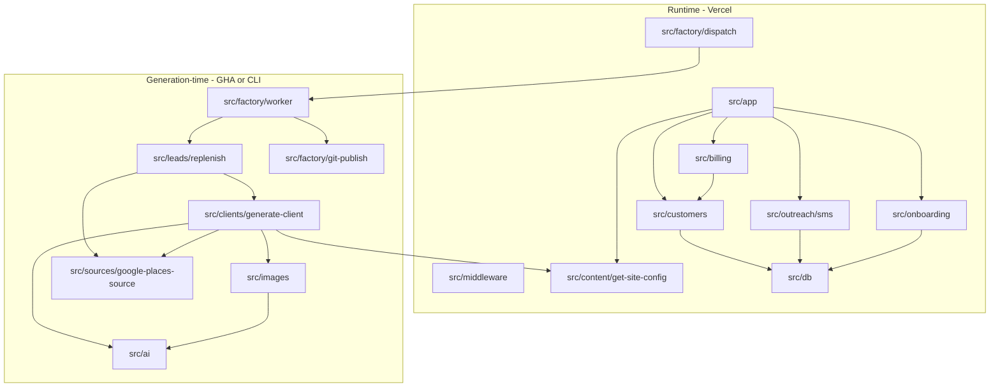
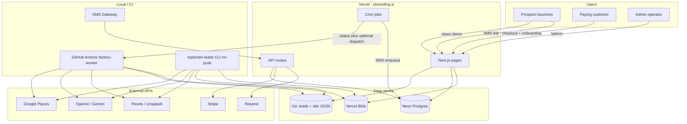
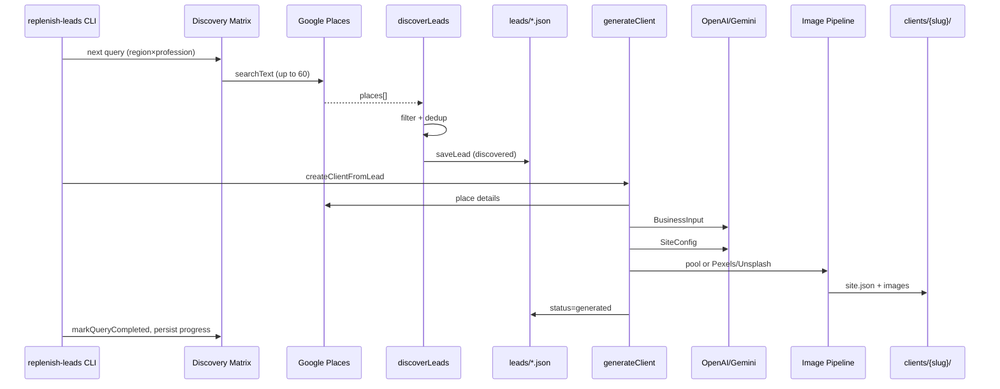
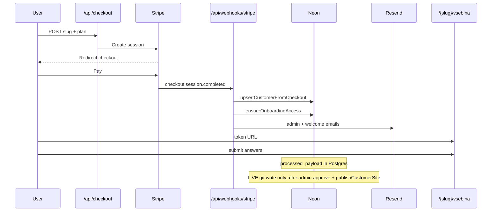
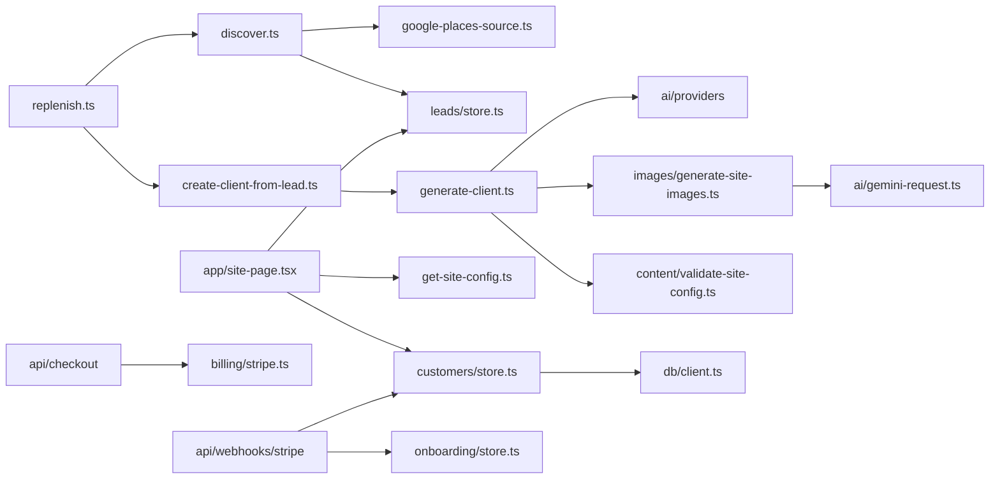

# Architecture — ai-websites

> **Verified against code:** 2026-09-01  
> **Source of truth:** `src/`, `scripts/`, `.github/workflows/`, `vercel.json`, `src/db/schema.ts`.  
> **Agent entry:** [AGENT-CONTEXT.md](./AGENT-CONTEXT.md). Factory lifecycle: [FACTORY.md](./FACTORY.md). Entities: [DOMAIN.md](./DOMAIN.md).  
> **Stale / unverified:** production values of `FACTORY_DISPATCH_ENABLED` / `FACTORY_GIT_TOKEN` (code default dispatch = false). Scale snapshot counts below are from 2026-08-31 and were not re-counted.  
> **Cost & reliability:** [FACTORY-COST-RELIABILITY-AUDIT.md](./FACTORY-COST-RELIABILITY-AUDIT.md).  
> **Performance (demo /{slug}):** [PERFORMANCE-AUDIT.md](./PERFORMANCE-AUDIT.md).

---

## 1. System overview

### What the application does

**ai-websites** (brand: [zbrendiraj.si](https://zbrendiraj.si)) is a Next.js application that:

1. **Discovers** Slovenian small businesses without websites via Google Places (Region × Profession matrix).
2. **Generates** AI-written demo websites (JSON content + stock images) and commits them to the repo.
3. **Serves** those demos at `/{slug}` and `/demo/{slug}` with industry-specific appearance templates.
4. **Outreaches** via SMS (queued in Postgres, sent by a local HiLink gateway).
5. **Converts** interested businesses through Stripe Checkout → subscription + upsells.
6. **Onboards** paying customers via a token-gated form; `processed_payload` lives in Postgres until admin approve dispatches GitHub Action `customer-publish`, which writes `site.json` and git-pushes (`src/onboarding/publish-customer.ts`). Submit itself does **not** write git.

The product is a **single monolithic Next.js deployment** on Vercel. There is no separate backend service. Heavy generation and git publish run on **GitHub Actions** (`factory-worker.yml`) or **local CLI**, never on Vercel (ephemeral FS).

### Main architectural components

| Component | Location | Role |
|-----------|----------|------|
| **Next.js app** | `src/app/` | Pages, API routes, middleware |
| **Content layer** | `src/content/` | Site configs (`site.json`), leads, templates |
| **Lead discovery** | `src/leads/` | Matrix-driven Places search, filtering, replenish |
| **AI generation** | `src/ai/`, `src/clients/` | Business input + site config generation |
| **Appearances** | `src/appearances/` | Industry UI templates (beauty, trade, zbrendiraj, default) |
| **Images** | `src/images/` | Pool, Pexels/Unsplash, AVIF/WebP, Vercel Blob |
| **Billing** | `src/billing/`, `src/customers/` | Stripe checkout, notifications |
| **Onboarding** | `src/onboarding/` | Post-purchase customer content collection |
| **SMS outreach** | `src/outreach/sms/` | Queue, eligibility, templates |
| **SMS gateway** | `tools/sms-gateway/` | Local poller + Huawei HiLink modem |
| **Factory worker** | `src/factory/` | Lease, discovery-progress store, generation locks, git publish, GHA dispatch |
| **Demo lifecycle** | `src/demo-lifecycle/` | generated → published → viewed → purchased (Neon) |
| **Database** | `src/db/` | Neon Postgres schema (`schema.ts`) + serverless client |
| **Admin** | `src/app/admin/` | Lead pipeline + `/admin/factory` ops UI (cookie auth) |
| **Scripts** | `scripts/` | CLI for generation, discovery, factory worker, customer publish |
| **GitHub Actions** | `.github/workflows/` | `factory-worker.yml`, `customer-publish.yml` |

### Main runtime / deployment environments

| Environment | Purpose |
|-------------|---------|
| **Vercel production** | Serves demos, checkout, webhooks, crons (enqueue/dispatch only), admin, contact |
| **GitHub Actions** | Factory generate+git push; customer LIVE publish |
| **Local dev / CLI** | `next dev`; `replenish-leads` (no push); `factory-worker` (push if enabled) |
| **Local SMS gateway** | `tools/sms-gateway` on `127.0.0.1:8787` polls production API |
| **Git** | Source of truth for demo/LIVE site JSON (`src/content/clients/`, `src/content/leads/`) |
| **Neon Postgres** | Customers, purchases, onboarding, SMS, factory leases/progress, demo lifecycle |
| **Vercel Blob** | Production image storage (optional local fallback to `public/`) |

**Production domain:** `zbrendiraj.si` (custom domain mapped in `src/lib/custom-domains.ts`). Legacy hostname `splet.vercel.app` redirects to `zbrendiraj.si` (`src/middleware.ts`, `next.config.ts`).

---

## 2. Repository structure

```
ai-websites/
├── src/                    # Application source (~273 TS/TSX files)
│   ├── app/                # Next.js App Router — pages + API routes
│   ├── ai/                 # AI providers, validation, Gemini rate limiter
│   ├── appearances/        # Template registry + per-industry page components
│   ├── billing/            # Stripe helpers, checkout notifications
│   ├── clients/            # generateClient, createClientFromLead
│   ├── components/         # Shared UI (contact form, sections, legal)
│   ├── contact/            # Contact form email sender
│   ├── content/            # JSON content: clients/, leads/, sites/, types
│   ├── customers/          # Neon customer/purchase CRUD
│   ├── db/                 # Schema SQL strings, Neon client
│   ├── factory/            # Worker, git publish, dispatch, leases, discovery-progress store
│   ├── demo-lifecycle/     # View tracking + funnel statuses (Neon)
│   ├── images/             # Image pipeline (pool, providers, storage)
│   ├── leads/              # Discovery matrix, store, replenish
│   ├── lib/                # Auth, custom domains
│   ├── logs/               # Generation logging
│   ├── onboarding/         # Customer onboarding + LIVE publish apply
│   ├── outreach/           # Email outreach (legacy) + SMS outreach (active)
│   ├── privacy/            # Legal page content + validation
│   ├── sources/            # Google Places business source
│   └── theme/              # Theme assignment, fonts, palettes
├── scripts/                # CLI tools
├── tools/sms-gateway/      # Local SMS sender (separate Node package)
├── .github/workflows/      # factory-worker.yml, customer-publish.yml
├── data/                   # Gitignored runtime state (progress mirror, caches)
├── public/                 # Static assets; client/stock images when not on Blob
├── docs/                   # AGENT-CONTEXT.md is the agent entry
├── vercel.json             # Cron schedules
└── package.json            # npm scripts
```

### Core modules vs supporting utilities

**Core (production path):**

- `src/leads/replenish.ts` — discovery + demo generation orchestrator
- `src/factory/worker.ts` — lease + replenish + git publish (GHA / CLI)
- `src/clients/generate-client.ts` — AI + images + JSON persistence
- `src/content/get-site-config.ts` — runtime site config loading
- `src/app/site-page.tsx` — shared demo/customer page renderer
- `src/app/api/webhooks/stripe/route.ts` — payment → customer state
- `src/onboarding/publish-customer.ts` — LIVE apply + git push
- `src/outreach/sms/*` — SMS pipeline
- `src/db/schema.ts` — persistent state definitions

**Supporting / operational:**

- `scripts/*` — one-off generation, backfills, test harnesses
- `src/leads/select.ts`, `scripts/discover-leads.ts` — standalone discovery (legacy industry mode)
- `src/leads/icp.ts`, `src/leads/slot-yield.ts` — **obsolete** ICP rotation (see §15)
- `src/outreach/send.ts`, `src/outreach/process-batch.ts` — email outreach (manual/cron-disabled)
- `src/logs/generation-log.ts` — optional generation audit trail

---

## 3. End-to-end data flows

### 3.1 Lead discovery

```
CLI: npm run factory-worker     [scripts/factory-worker.ts → runFactoryWorker]
  OR GitHub Action factory-worker.yml (schedule / repository_dispatch factory-generate)
  OR CLI: npm run replenish-leads  [does NOT commit/push]

  → replenishSmsLeads()                    [src/leads/replenish.ts]
    → loadDiscoveryProgress()              [Neon factory_discovery_progress if DATABASE_URL;
                                            else data/lead-discovery-progress.json]
    → findActiveCombination() / advancePointer()
    → buildSearchSurface(region, profession) [src/leads/discovery-matrix.ts]
    → nextQueryInSurface() → query string
    → discoverLeads(query, 60, opts)       [src/leads/discover.ts]
        → searchPlaces()                   [src/sources/google-places-source.ts]
        → filter: placeId dedup, region, website, mobile, profession match
        → saveLead()                       [src/leads/store.ts → src/content/leads/{slug}.json]
    → markQueryCompleted() + saveDiscoveryProgress()
    → createClientFromLead() per candidate (worker wraps with generation lock)
```

**Vercel cron** (`GET /api/cron/replenish-leads`, `0 6 * * *`): `getReplenishStatus()` always. If `needed > 0` and `FACTORY_DISPATCH_ENABLED` + GitHub creds, `dispatchFactoryWorker()` (`src/factory/dispatch.ts`) fires `repository_dispatch: factory-generate`. Never generates on Vercel (`src/app/api/cron/replenish-leads/route.ts`).

### 3.2 Lead filtering / qualification

Filtering happens at three layers:

1. **During discovery** (`discover.ts`): known `googlePlaceId`, address region match, no website, Slovenian mobile, profession pattern match, slug usability.
2. **Post-discover in replenish** (`replenish.ts`): re-reads saved lead, `isSmsGenerationCandidate()`, `clientSiteExists()`.
3. **Before generation** (`create-client-from-lead.ts`): same SMS candidate checks + `clientExists()`.

SMS eligibility is centralized in `src/outreach/sms/relevance.ts` (`isSmsGenerationCandidate`, `countActionableSmsLeads`).

### 3.3 Demo / client generation

```
createClientFromLead(slug)                 [src/clients/create-client-from-lead.ts]
  → readLead(slug)
  → createPlaceDetailsSource(placeId)      [src/sources/google-places-source.ts]
  → generateClient(slug, source)           [src/clients/generate-client.ts]
      → validateRawBusinessData()
      → generateBusinessInput()            [src/ai/generate-business-input.ts]
      → generateSiteConfig()               [src/ai/generate-site-config.ts]
      → appearanceForIndustry() + assignTheme() + assignLayout()
      → generateSiteImages()
      → applyNewLeadSectionDefaults()
      → validateSiteConfig()
      → write business.json + site.json
      → saveLead(status: "generated")
```

Outputs:

- `src/content/clients/{slug}/business.json` — structured business input
- `src/content/clients/{slug}/site.json` — full site config (sections, theme, images)
- Updated `src/content/leads/{slug}.json`

### 3.4 AI generation

See §6. Two sequential AI calls per demo (BusinessInput → SiteConfig), plus a third Gemini call for image search planning. Each text stage allows **one content-correction retry** on validation failure.

### 3.5 Image discovery / download / storage

```
generateSiteImages()                       [src/images/generate-site-images.ts]
  → buildImageSearchPlan()                 [src/images/build-search-queries.ts — Gemini]
  → resolveImagePoolCategory()
  → generateImagesFromPool()               [preferred: src/images/image-pool.ts]
      OR downloadStockPhoto()              [Pexels → Unsplash fallback]
  → optimizeStockImage() → AVIF + WebP     [src/images/optimize-image.ts]
  → storeClientImages() / storeStockImages() [src/images/storage.ts → Blob or public/]
  → attribution metadata in site.json images block
```

Pool state: `data/image-asset-cache.json` (gitignored).

### 3.6 Generated site serving

```
HTTP GET /{slug}
  → middleware (demo rewrite, custom domain, admin gate)
  → src/app/[slug]/page.tsx
  → getSiteConfig(slug)                    [src/content/get-site-config.ts]
  → SitePage                               [src/app/site-page.tsx]
      → appearanceRegistry[appearance].Page
      → DemoPurchaseBar (if not customer)
      → CustomerPreparingBar (if customer)
```

Despite `generateStaticParams()` listing all slugs, routes export `dynamic = "force-dynamic"` — configs are bundled at build via webpack `require.context`, but pages render dynamically at request time.

View tracking: `after(() => recordDemoView(slug, viewContext))` in `src/app/[slug]/page.tsx` (Neon; no-op without `DATABASE_URL`; skips customers and excluded slugs).

### 3.7 SMS outreach

```
Vercel cron GET /api/cron/sms-outreach
  → enqueueDueSmsBatch()                   [src/outreach/sms/enqueue-batch.ts]
      → eligibility checks
      → enqueueSmsForLead()                [src/outreach/sms/queue.ts]
      → Neon: sms_messages + sms_lead_state

Local tools/sms-gateway poller
  → GET /api/outreach/sms/queue            [claim batch, Bearer SMS_GATEWAY_SECRET]
  → send via HiLink modem
  → POST /api/outreach/sms/result
  → POST /api/outreach/sms/inbound (replies, STOP/opt-out)
```

### 3.8 Stripe checkout / subscription

```
Demo page DemoPurchaseBar → POST /api/checkout { slug, plan }
  → Stripe Checkout Session (subscription)
  → success → /{slug}/upsell?session_id=...

Upsell page → POST /api/checkout/upsell { slug, session_id, upsell_type }
  → Stripe Checkout Session (one-time or subscription per upsell)
```

Upsell definitions: `src/billing/upsells.ts` (google_business, seo, professional_email).

### 3.9 Webhook → database → customer/site state

```
POST /api/webhooks/stripe                   [src/app/api/webhooks/stripe/route.ts]
  → stripe.webhooks.constructEvent()        [STRIPE_WEBHOOK_SECRET]
  → checkout.session.completed only
      ├─ base subscription:
      │    upsertCustomerFromCheckout()     [src/customers/store.ts → Neon customers + customer_purchases]
      │    ensureOnboardingAccess()         [src/onboarding/store.ts → customer_onboarding]
      │    sendCheckoutNotification()       [admin email via Resend]
      │    sendOnboardingCustomerEmail()    [welcome + onboarding URL]
      └─ upsell:
           recordCustomerUpsellPurchase()
           sendUpsellNotification()
```

**Important:** Paying customer state lives in **Postgres**, not in lead JSON (though `src/leads/store.ts` has optional stripe fields for merge/backfill). Demo content in git is **not** updated on purchase. LIVE content is written only by `publishCustomerSite()` after admin approve.

### 3.10 Customer LIVE publish

```
Admin POST /api/admin/onboarding/[slug]/approve
  → approveOnboardingForPublish()          [src/onboarding/store.ts]
  → dispatchCustomerPublish()              [src/onboarding/dispatch-customer-publish.ts]
       (no-op unless FACTORY_DISPATCH_ENABLED + FACTORY_GITHUB_*)

GitHub Action customer-publish.yml
  → publishCustomerSite(slug)              [src/onboarding/publish-customer.ts]
      → claimCustomerPublishLease()
      → applyCustomerSite()                [writes site.json + business.json;
                                            first-time snapshot → clients/{slug}/demo/]
      → gitPublishPaths()                  [src/factory/git-publish.ts]
      → markCustomerPublished()            [status live]
```

Retry: `POST /api/admin/onboarding/[slug]/retry-publish`. Manual: `npm run publish-customer -- <slug>`.

### 3.11 Admin / lead management

```
/admin/leads                               [src/app/admin/leads/page.tsx]
  → readAllLeads() from filesystem
  → getCustomerSlugSet() from Neon
  → listSmsLeadStates() from Neon
  → filterAdminLeadRows()                    [src/admin/leads-filters.ts]

/admin/leads/{slug}                        [detail + manual SMS queue, outreach, onboarding approve]
/admin/factory                             [src/app/admin/factory/page.tsx → getFactoryOpsSnapshot]

Auth: ADMIN_SECRET cookie via middleware    [src/middleware.ts, src/lib/auth.ts]
```

---

## 4. Dependency map

### High-level dependencies



### Central modules (many dependents)

| Module | Dependents |
|--------|------------|
| `src/content/get-site-config.ts` | All slug pages, checkout, contact, onboarding |
| `src/leads/store.ts` | Discovery, admin, site-page, checkout-lead |
| `src/db/client.ts` | customers, SMS, onboarding |
| `src/ai/gemini-request.ts` | All Gemini call sites |
| `src/content/validate-site-config.ts` | Generation + runtime config load |
| `src/outreach/sms/relevance.ts` | Replenish, generation gates, admin |

### Coupling hotspots

1. **`readAllLeads()`** — O(n) filesystem scan; used in discovery dedup, admin, and several filters. Does not scale linearly.
2. **`getSiteConfig()` webpack context** — all client `site.json` files bundled into server chunks at build time.
3. **Lead JSON ↔ customer Postgres** — dual stores for commercial state; `src/customers/merge.ts` and lead stripe fields exist but Postgres is authoritative for customers.
4. **Image pool ↔ discovery professions** — `DISCOVERY_PROFESSION_ORDER` equals `IMAGE_POOL_CATEGORY_IDS` (`src/leads/discovery-professions.ts`).

---

## 5. External services

| Service | Purpose | Called from | In / Out | Criticality | Rate limit / retry | Env vars |
|---------|---------|-------------|----------|-------------|-------------------|----------|
| **Google Places API** | Text search (discovery) + place details (generation) | `src/sources/google-places-source.ts` | Query/placeId → business fields | Generation-time (discovery); runtime only if details fetched on-demand | 2s delay between paginated pages; no global limiter | `GOOGLE_PLACES_API_KEY` |
| **OpenAI** | BusinessInput + SiteConfig when `AI_PROVIDER=openai` | `src/ai/providers/openai.ts`, `generate-business-input/openai.ts` | Raw business → JSON | Generation-time only | **None** in code | `OPENAI_API_KEY`, `AI_PROVIDER` |
| **Google Gemini** | BusinessInput + SiteConfig (when gemini) + image search plans (always) | `src/ai/providers/gemini.ts`, `generate-business-input/gemini.ts`, `src/images/build-search-queries.ts` | Prompts → JSON | Generation-time only | Serial queue 4100ms; 429 retry up to 3× | `GEMINI_API_KEY`, `GEMINI_MIN_REQUEST_INTERVAL_MS`, `GEMINI_MAX_429_RETRIES`, `AI_PROVIDER` |
| **Pexels** | Stock photos (primary) | `src/images/providers/pexels.ts` | Search query → photo metadata + download URL | Generation-time | Retry on 403/429 | `PEXELS_API_KEY` |
| **Unsplash** | Stock photos (fallback) | `src/images/providers/unsplash.ts` | Search + download trigger | Generation-time | Global rate limit file `data/.unsplash-search-times.json` | `UNSPLASH_ACCESS_KEY` |
| **Vercel Blob** | Image storage in production | `src/images/storage.ts`, onboarding upload | Binary AVIF/WebP | Generation-time + runtime (image serving) | SDK-managed | `BLOB_READ_WRITE_TOKEN`, `BLOB_STORE_ID`, `VERCEL_OIDC_TOKEN`, `VERCEL` |
| **Vercel** | Hosting, crons, OIDC for Blob | Platform | — | **Runtime-critical** | Platform limits | `VERCEL`, `VERCEL_URL`, `CRON_SECRET` |
| **Neon Postgres** | Customers, SMS, onboarding | `src/db/client.ts` | SQL via `@neondatabase/serverless` | **Runtime-critical** for checkout/SMS/onboarding | Connection per request | `DATABASE_URL`, `POSTGRES_URL`, `POSTGRES_PRISMA_URL` |
| **Stripe** | Checkout, subscriptions, upsells | `src/billing/stripe.ts`, webhooks, checkout routes | Sessions, webhooks | **Runtime-critical** for revenue | Stripe SDK; webhook 500 → retry | `STRIPE_SECRET_KEY`, `STRIPE_WEBHOOK_SECRET`, price IDs |
| **Resend** | Transactional + outreach email | `src/billing/notify*.ts`, `src/contact/send-email.ts`, `src/outreach/resend.ts` | HTML/text email | Runtime (checkout/onboarding/contact); email outreach optional | Returns `{ retryable }` in outreach sender | `RESEND_API_KEY`, `CHECKOUT_NOTIFY_EMAIL`, `OUTREACH_FROM_EMAIL`, `OUTREACH_FROM_NAME`, `RESEND_WEBHOOK_SECRET` |
| **Huawei HiLink (modem)** | Physical SMS send/receive | `tools/sms-gateway/src/modem/hilink.ts` | SMS body, inbox poll | **Runtime-critical** for SMS delivery | Local poller delay `SMS_MIN_DELAY_MS` | `HILINK_URL`, gateway `.env` |
| **GitHub** | Version control / deploy trigger | External (Vercel integration) | Git push → deploy | Deploy pipeline | — | Not referenced in application code |
| **Cloudflare** | DNS/CDN (inferred) | Not in code | — | Infrastructure | — | Mentioned only in privacy copy (`src/privacy/components/zbrendiraj/ZbrendirajTermsContent.tsx`) |

**Note:** `nodemailer` is listed in `package.json` but has **no imports** in the codebase — dead dependency.

---

## 6. AI architecture

### Provider abstraction

Two factory entry points, both keyed on `process.env.AI_PROVIDER ?? "openai"`:

- `getSiteConfigProvider()` — `src/ai/providers/index.ts`
- `getBusinessInputProvider()` — `src/ai/providers/generate-business-input/index.ts`

Each returns a thin adapter implementing `generate*(input, correction?)` calling shared prompt parsers.

| Provider | Model | JSON mode |
|----------|-------|-----------|
| OpenAI | `gpt-4.1-mini` | `response_format: { type: "json_object" }` |
| Gemini | `gemini-3.5-flash-lite` | `responseMimeType: "application/json"` |

### Call sites

| Call | Provider selection | File |
|------|-------------------|------|
| BusinessInput | `AI_PROVIDER` | `src/ai/providers/generate-business-input/{openai,gemini}.ts` |
| SiteConfig | `AI_PROVIDER` | `src/ai/providers/{openai,gemini}.ts` |
| Image search plan | **Always Gemini** | `src/images/build-search-queries.ts` |

All Gemini calls go through `generateGeminiContent()` in `src/ai/gemini-request.ts`.

### Validation / schema flow

```
RawBusinessData
  → validateRawBusinessData()              [src/ai/validate-raw-business-data.ts]

BusinessInput (post-AI)
  → sanitizeJsonResponse + JSON.parse
  → validateBusinessInput()                [src/ai/validate-business-input.ts]

SiteConfig (post-AI, in provider)
  → normalizeGallerySection() if gallery present [src/content/apply-new-lead-sections.ts]
  → validateSiteConfig()                   [src/content/validate-site-config.ts — Zod]
  → validateGeneratedSiteConfig()          [src/ai/validate-generated-site-config.ts — quality bounds]
  → validateClaims()                       [src/ai/validate-claims.ts — factual guard]

Final persist
  → applyNewLeadSectionDefaults()
  → validateSiteConfig() again
```

### Generation retries

Orchestrators `src/ai/generate-business-input.ts` and `src/ai/generate-site-config.ts`:

- On `GenerationContentError` (`src/ai/generation-error.ts`): **one** retry with correction message appended to user prompt.
- Non-content errors (missing API key, transport): fail immediately.

### Gemini rate limiter

`src/ai/gemini-request.ts`:

- **Proactive:** serial `acquireGeminiSlot()` — minimum **4100 ms** between requests (~13 RPM).
- **Reactive:** on 429, parse `RetryInfo.retryDelay`, wait (default 60s + 250ms jitter), up to **3** attempts.
- Shared in-process chain across all Gemini callers in a single Node process (CLI batch runs benefit; multiple Vercel instances would not share state — but Gemini is generation-time only today).

### Failure handling

| Failure | Behavior |
|---------|----------|
| Invalid JSON / Zod / quality / claims | `GenerationContentError` → 1 correction retry |
| Empty model response | `GenerationContentError` |
| Missing API key | Hard error, no retry |
| Gemini 429 after retries | Throws; replenish logs error, may stop run |
| Image generation failure | `generateSiteImages` catches, may return `undefined` (site without images) |

### Prompts

| Stage | File |
|-------|------|
| SiteConfig system + user + parse | `src/ai/providers/prompt.ts` |
| BusinessInput system + user + parse | `src/ai/providers/generate-business-input/prompt.ts` |
| Image search plan (inline system prompt) | `src/images/build-search-queries.ts` |

### Normalization / defaults

| When | What | File |
|------|------|------|
| Pre-validation (in provider) | Partial gallery fields | `normalizeGallerySection()` in `apply-new-lead-sections.ts` |
| Post-AI | Gallery, pricing, nav links for new leads | `applyNewLeadSectionDefaults()` |
| Final Zod | `appearance`, `privacy`, business merge | `validate-site-config.ts` |
| Deterministic | Theme, layout, appearance by industry | `assign-theme.ts`, `assign-layout.ts`, `industry-appearance.ts` |

---

## 7. Lead discovery architecture

### Region × Profession Discovery Matrix

**Dimensions:** 12 regions × 16 professions = **192 combinations** (`src/leads/discovery-matrix.ts`, `discovery-regions.ts`, `discovery-professions.ts`).

**Regions (density-first order):** osrednjeslovenska, podravska, gorenjska, pomurska, savinjska, zasavska, posavska, jugovzhodna-slovenija, primorsko-notranjska, goriska, obalno-kraska, koroska.

**Professions:** Shared IDs with image pool categories (e.g. `nohti-pedikura`, `avtomehaniki`, `elektricarji`, …).

### Search surfaces / queries

Per cell, `buildSearchSurface()` creates:

1. **High-value queries:** `{googleTerm} {regionName}` + `{googleTerm} {each town}` (5–10 towns per region).
2. **Optional queries:** from profession `extraQueryTerms` (only `nohti-pedikura` has extra term `"nohti"`), deduped against high-value set.

Example google terms differ from display names (`frizerji` → `"frizer"`, `avtomehaniki` → `"avtoservis"`).

### Progress persistence

**File:** `data/lead-discovery-progress.json` (gitignored)

**Schema version 1** (`src/leads/discovery-progress.ts`): pointer (`currentRegionId`, `currentProfessionId`), per-combination stats (`queriesCompleted`, `zeroYieldStreak`, lead counts, rejection counters), `status`: pending | active | completed.

Written after each query attempt and on combination activation/completion.

### Completion rules

Per combination (`shouldCompleteCombination` in `discovery-progress.ts`):

1. **`zeroYieldStreak >= 3`** (configurable via `DISCOVERY_ZERO_YIELD_COMPLETION_STREAK`) → early complete.
2. **All high-value queries exhausted** → can complete before optional queries.
3. **No remaining queries** → `all_queries_exhausted`.

Whole matrix complete when all 192 cells are `completed`.

### Resume behavior

On restart, `readDiscoveryProgress()` restores pointer and per-combination `queriesCompleted`. Active/pending cells resume from next unattempted query via `nextQueryInSurface()`.

### Run-level caps (`src/leads/discovery-config.ts`)

| Setting | Default | Env |
|---------|---------|-----|
| Places per query | 60 | — |
| Max searches per run | 80 | `DISCOVERY_MAX_SEARCHES_PER_RUN` |
| Zero-yield streak threshold | 3 | `DISCOVERY_ZERO_YIELD_COMPLETION_STREAK` |

Stop reasons: `target_met`, `global_search_limit`, `all_combinations_exhausted`, Places API error.

### Filtering & deduplication

See §3.2. Key functions: `professionMatchesBusiness()` (`discovery-professions.ts`), `matchesDiscoveryRegion()` / `getRegionLocationBias()` (`region.ts`, `discovery-regions.ts`), `uniqueSlug()` (`src/clients/slug.ts`), `findLeadByPlaceId()`.

### Batch / replenishment flow

`replenishSmsLeads()` targets actionable SMS lead count (`SMS_LEAD_TARGET`, default 500) minus current actionable (`countActionableSmsLeads`). For each discovered lead passing filters, calls `createClientFromLead()` inline. Demos must be **committed to git** and deployed to appear on production.

---

## 8. Generated content architecture

### Entity relationships

```
Google Place
  → LeadRecord          src/content/leads/{slug}.json     [source-of-truth for pipeline state]
  → BusinessInput       src/content/clients/{slug}/business.json  [generated, AI-normalized]
  → SiteConfig          src/content/clients/{slug}/site.json      [generated, validated]
  → Images              URLs in site.json + blobs in Vercel Blob / public/clients/
  → CustomerRecord      Neon `customers` table              [post-purchase source-of-truth]
  → Onboarding          Neon `customer_onboarding`          [customer-edited content, not in git]
```

### Source-of-truth vs derived

| Data | Source of truth | Notes |
|------|-----------------|-------|
| Lead pipeline status, notes, outreach | `src/content/leads/*.json` | `saveLead()` preserves sales-owned fields |
| Demo / LIVE site content | `src/content/clients/{slug}/site.json` | Bundled at build; git-versioned |
| Business facts for demo | `business.json` | Derived from Places + AI; rewritten on LIVE publish |
| Paying customer | Neon `customers` | Authoritative over lead stripe fields |
| Purchases / upsells | Neon `customer_purchases` | Idempotent on checkout session ID |
| Customer content updates | Neon `customer_onboarding.processed_payload` | Applied to git only via `publishCustomerSite` |
| SMS state | Neon `sms_lead_state`, `sms_messages` | |
| Discovery progress | Neon `factory_discovery_progress` when DB set; else local file | Local file is fallback/mirror (`src/factory/discovery-progress-store.ts`) |
| Factory worker | Neon `factory_worker_lease`, `factory_worker_runs`, `factory_generation_locks` | |
| Demo funnel | Neon `demo_lifecycle`, `demo_view_dedupe` | |
| Image pool cache | `data/image-asset-cache.json` | Local / GHA only |

### Static vs generated

- **Static/template:** `src/appearances/*`, `src/theme/*`, `src/content/sites/_templates/` (legacy template dir).
- **Generated per lead:** `business.json`, `site.json`, image assets.
- **Legacy path:** `src/content/sites/{slug}.json` — supported in `getSiteConfig()` but `legacySiteSlugs` is currently empty (no top-level site JSON files).

### Template architecture

`appearanceRegistry` (`src/appearances/registry.ts`): `default`, `beauty`, `zbrendiraj`, and trade variants (`elektro`, `construction`, `cleaning`, `health`, `auto`) sharing `TradeSitePage`.

Assignment: `appearanceForIndustry()` in `src/appearances/industry-appearance.ts` from industry string + company name.

---

## 9. Persistence

| Mechanism | Path / service | Stored | Why |
|-----------|----------------|--------|-----|
| **Git (committed JSON)** | `src/content/leads/`, `src/content/clients/` | Leads, demos | Deployed demo catalog; version history |
| **Gitignored JSON** | `data/lead-discovery-progress.json` | Matrix progress mirror / CLI fallback | Resume without Neon; worker prefers Neon |
| **Gitignored JSON** | `data/image-asset-cache.json` | Image pool v2 assets + usage | Avoid re-fetching stock photos |
| **Gitignored JSON** | `data/replenish-cursor.json`, `data/replenish-slot-yield.json` | Legacy ICP cursor/yield | Obsolete; still in `.gitignore` |
| **Gitignored JSON** | `data/.unsplash-search-times.json` | Unsplash rate limit timestamps | API compliance |
| **Local filesystem** | `public/clients/`, `public/stock/` | AVIF/WebP when Blob unavailable | Dev/generation fallback |
| **Vercel Blob** | Remote | Production images + onboarding uploads | CDN-served assets |
| **Neon Postgres** | Remote | customers, SMS, onboarding, factory_*, demo_lifecycle | Runtime transactional state |
| **In-memory** | Contact route `rateLimit` Map | IP rate limit counters | Resets on cold start |
| **In-memory** | `gemini-request.ts` chain | Gemini throttle state | Per-process only |
| **Logs** | `logs/` (gitignored) | Generation logs | Optional audit |

### Database schema

Defined as SQL strings in `src/db/schema.ts`, applied lazily via `ensureCustomerSchema()` / `ensureSmsSchema()` / `ensureFactorySchema()` in `src/db/ensure-schema.ts`.

`src/db/schema.sql` is a **manual/docs copy** and **lags** `schema.ts` (missing factory_*, demo_lifecycle, customer_publish_lease, some onboarding publish columns).

Tables: `customers`, `customer_purchases`, `customer_onboarding`, `customer_publish_lease`, `sms_messages`, `sms_lead_state`, `sms_inbound`, `factory_discovery_progress`, `factory_worker_lease`, `factory_worker_runs`, `factory_generation_locks`, `demo_lifecycle`, `demo_view_dedupe`.

---

## 10. Runtime vs build-time vs generation-time

| Operation | Classification |
|-----------|----------------|
| Serve demo pages, legal pages, OG images | **Request/runtime** (force-dynamic) |
| Stripe checkout + webhooks | **Request/runtime** |
| Contact form POST | **Request/runtime** |
| SMS queue claim/result/inbound | **Request/runtime** |
| SMS cron enqueue | **Webhook/background** (Vercel cron) — does not send radio SMS |
| Replenish cron | **Webhook/background** — status + optional GHA dispatch; no generation |
| Admin UI | **Request/runtime** |
| Onboarding form GET/PATCH/upload | **Request/runtime** |
| Demo view increment | **Request/runtime** (`after()` on slug page) |
| `next build` | **Build-time** — webpack bundles all `site.json` via `require.context` |
| `generateStaticParams` | **Build-time** route enumeration |
| `npm run factory-worker` | **GHA or CLI** — discovery + AI + images + git push |
| `npm run replenish-leads` | **CLI** — discovery + AI + images; **no** commit/push |
| `npm run publish-customer` | **GHA or CLI** — apply onboarding + git push |
| SMS gateway poller | **CLI/local** — long-running process |

---

## 11. Error handling & resilience

| Category | Implementation | Files |
|----------|----------------|-------|
| **AI content retry** | 1 correction attempt per stage | `generate-business-input.ts`, `generate-site-config.ts` |
| **Gemini 429** | Up to 3 retries with backoff | `gemini-request.ts` |
| **OpenAI rate limits** | Not handled | — |
| **Google Places pagination** | 2s token delay; errors stop replenish run | `google-places-source.ts`, `replenish.ts` |
| **Pexels 403/429** | Retry logic in provider | `pexels.ts` |
| **Unsplash** | File-based global rate limit | `unsplash-rate-limit.ts` |
| **Stripe webhook** | Signature verify → 400; handler error → 500 (Stripe retries) | `webhooks/stripe/route.ts` |
| **Idempotency** | Unique indexes on checkout session, upsell per slug, SMS active step | `schema.ts`, `customers/store.ts` |
| **SMS claim lease** | `claim_expires_at` for crash recovery | `sms/claim.ts` |
| **Validation failures** | Fatal after retry exhausted; replenish collects `errors[]` | `replenish.ts` |
| **Partial generation** | Images optional if keys missing; pool may partial-fallback to direct download | `generate-site-images.ts` |
| **Resend webhook** | Signature optional if secret unset | `webhooks/resend/route.ts` |
| **Contact form** | In-memory IP rate limit (5/min) | `api/contact/route.ts` |

**Fatal vs recoverable:**

- **Fatal (single lead):** Missing place ID, AI failure after retries → generation throws; replenish logs and continues.
- **Fatal (run):** Uncaught Places API error may set `runStopReason` and halt replenish.
- **Recoverable:** Duplicate place, wrong profession, existing website → skipped with reason.

---

## 12. Security

### Secrets / environment variables

All secrets via `.env*` (gitignored). No committed credentials observed. Key secrets: `ADMIN_SECRET`, `CRON_SECRET`, `SMS_GATEWAY_SECRET`, `STRIPE_*`, `DATABASE_URL`, API keys for Google/OpenAI/Gemini/Pexels/Unsplash/Resend.

### API routes

| Route | Auth |
|-------|------|
| `/admin/*` | Cookie `ADMIN_SECRET` via middleware |
| `/api/cron/*` | Bearer `CRON_SECRET` |
| `/api/outreach/sms/*` | Bearer `SMS_GATEWAY_SECRET` |
| `/api/admin/*` | Admin session (route-level checks) |
| `/api/checkout`, `/api/contact` | Public (validated input) |
| `/api/webhooks/stripe` | Stripe signature |
| `/api/webhooks/resend` | Svix signature **if** secret configured |

### Risks

| Risk | Severity | Detail |
|------|----------|--------|
| Resend webhook without secret | Medium | If `RESEND_WEBHOOK_SECRET` unset, verification skipped (`webhooks/resend/route.ts:13-26`) |
| Contact rate limit in-memory | Low | Resets on serverless cold start |
| Admin secret single shared password | Medium | Cookie-based; no RBAC |
| SMS gateway secret | High if leaked | Allows claim/send/report |
| Client-controlled slug in contact/checkout | Low | Validated against `getSiteConfig` / existing site |
| Onboarding token | Medium | UUID in URL; knowledge = access to form |

### Server/client boundaries

- API keys and Stripe secret stay server-side.
- `NEXT_PUBLIC_STRIPE_PUBLISHABLE_KEY` and pricing table ID used only in zbrendiraj appearance component.
- Demo `site.json` / `business.json` are public once deployed (read at build/runtime).

---

## 13. Scalability

Current scale: **529 leads**, **378 clients**, **192** matrix cells.

### Projections

| Scale | Likely impact |
|-------|---------------|
| **500 leads** | Near current; `readAllLeads()` ~529 file reads acceptable locally; admin page slower |
| **5,000 leads** | `readAllLeads()` on every discovery query becomes costly; admin unusable without pagination; git repo size grows |
| **50,000 leads** | Filesystem lead store impractical; discovery dedup O(n) per query prohibitive; need DB or index |
| **10,000 websites** | `next build` webpack context for 10k `site.json` files — major build time + server bundle size; `generateStaticParams` overhead |

### API / rate-limit constraints

| Bottleneck | Limit |
|------------|-------|
| Gemini free tier | ~15 RPM — mitigated by 4100ms limiter; batch of 100 demos ≈ 300+ Gemini calls ≈ hours |
| Google Places | 60 results/query, 80 queries/run default; billing tier on field masks |
| SMS | `SMS_DAILY_LIMIT` default 100; physical modem throughput |
| Vercel serverless | Ephemeral FS — cannot run replenish on platform |
| Neon | Serverless connection per invocation; fine at current volume |

---

## 14. Architecture risks / technical debt

| Rank | Issue | Why | Files |
|------|-------|-----|-------|
| **CRITICAL** | Demo generation not on Vercel | Production demos require GHA or local worker + git push | `replenish-leads/route.ts`, `factory/worker.ts` |
| **CRITICAL** | SMS depends on local gateway | No SMS if poller/modem offline | `tools/sms-gateway/` |
| **HIGH** | Dual lead/customer state | Lead JSON vs Postgres can drift | `leads/store.ts`, `customers/store.ts` |
| **HIGH** | O(n) lead filesystem scans | Blocks discovery dedup and admin at scale | `leads/store.ts` `readAllLeads()` |
| **HIGH** | All site configs bundled at build | Build/memory grows with client count | `get-site-config.ts` |
| **MEDIUM** | Legacy ICP code retained | Confusion with matrix system | `icp.ts`, `slot-yield.ts` |
| **MEDIUM** | Email outreach half-disabled | Cron stub; dual outreach codepaths | `cron/outreach/route.ts`, `outreach/` |
| **MEDIUM** | OpenAI without rate limiter | Batch runs can hit limits | `providers/openai.ts` |
| **MEDIUM** | Resend webhook optional verify | Spoofed events if secret missing | `webhooks/resend/route.ts` |
| **MEDIUM** | LIVE publish dispatch gated | Approve is a no-op dispatch if env unset | `dispatch-customer-publish.ts` |
| **LOW** | `nodemailer` unused dependency | Package bloat | `package.json` |
| **LOW** | force-dynamic + generateStaticParams | Misleading static optimization intent | `[slug]/page.tsx` |
| **LOW** | In-memory contact rate limit | Weak abuse protection | `api/contact/route.ts` |

---

## 15. Duplication / unnecessary complexity

| Item | Type | Detail |
|------|------|--------|
| `icp.ts` + `slot-yield.ts` | **Obsolete** | 26-slot rotation replaced by matrix; zero imports from replenish |
| `industry-filter.ts` (13 industries) | **Legacy parallel** | Still used by `discover-leads.ts` / `generate-leads.ts`, not matrix replenish |
| `region.ts` (2 legacy regions) | **Bridge code** | Maps old IDs; matrix uses `discovery-regions.ts` |
| Email + SMS outreach | **Overlapping** | Two channels, shared lead store; email cron disabled |
| Lead stripe fields + Postgres customers | **Duplicated state** | `SALES_OWNED_FIELDS` tries to protect merge |
| `replenish-cursor.json` / `replenish-slot-yield.json` | **Unused gitignore entries** | Legacy persistence |
| `src/content/sites/*.json` path | **Legacy loader** | Empty; all clients under `clients/{slug}/` |
| Two notify files for onboarding approval | **Naming overlap** | `notify-onboarding-approved.ts` vs `notify-onboarding-approval.ts` |
| `billing/addons.ts` | **Defined but unwired** | Add-on price env keys exist, not in checkout flow |

### Appears unused

- `src/leads/slot-yield.ts` (only self + `icp.ts`)
- `nodemailer` package
- `/api/cron/outreach` (returns skipped JSON)
- Legacy `data/replenish-cursor.json` mechanism (no code references in matrix path)

---

## 16. Recommended target architecture

**Goal:** Preserve business model (discover → demo → SMS → Stripe → onboard) while reducing operational fragility. **Do not implement here.**

**Already built since this section was first written (2026-08-31 → verified 2026-09-01):** GitHub Actions factory worker + git publish; Neon discovery progress + worker leases + generation locks; customer LIVE publish GHA; demo view tracking; `/admin/factory`. Remaining: lead index in Postgres, lazy site config loading, churn webhook, unconverted cleanup, delete ICP dead code.

### Target shape

```
┌─────────────────────────────────────────────────────────────┐
│                     Vercel (runtime)                         │
│  Next.js app │ Stripe webhooks │ SMS API │ Admin │ Crons    │
└──────────────────────────┬──────────────────────────────────┘
                           │
         ┌─────────────────┼─────────────────┐
         ▼                 ▼                 ▼
   Neon Postgres    Vercel Blob      External APIs
   (leads index,     (all images)     (Stripe, Resend,
    customers,                         Places read-only)
    SMS, onboarding)
         ▲
         │
┌────────┴────────┐
│ Generation worker│  ← GitHub Action or dedicated worker VM
│ (replenish, AI,  │    Commits demos OR writes to Blob+DB
│  images)         │    Triggered by cron status webhook
└─────────────────┘
```

### Principles

1. **Single source of truth per concern:** Postgres for commercial + pipeline index; git or Blob for published site JSON (pick one publish path).
2. **Indexed lead store:** Replace `readAllLeads()` scans with Postgres `leads` table (`google_place_id` unique, status indexed).
3. **Generation worker:** Move replenish off laptop to CI/worker with secrets; status cron triggers worker when `needed > 0`. **Partially done:** GHA `factory-worker.yml` + optional Vercel dispatch (default off).
4. **Lazy site config loading:** Replace webpack `require.context` with filesystem read or DB fetch for large catalogs.
5. **SMS:** Consider managed SMS provider OR document gateway as required infra with health checks.
6. **Delete legacy ICP/slot-yield** once confirmed no scripts depend on them.
7. **Onboarding publish pipeline:** Explicit admin approve → git commit. **Done:** `publishCustomerSite` + `customer-publish.yml` (dispatch still env-gated).

---

## 17. Architecture diagrams

### High-level system



### Lead discovery → demo generation



### Stripe / customer persistence



### Module dependencies (simplified)



---

## 18. Executive summary

### 5 strongest architectural decisions

1. **Git-versioned demo content** — Simple deploy model; every demo is reviewable, diffable, and served without a CMS (`src/content/clients/`).
2. **Region × Profession matrix with persistent progress** — Systematic coverage of Slovenia with resumable, measurable discovery (`discovery-progress.ts`, `discovery-matrix.ts`).
3. **Layered AI validation** — Zod schema + quality bounds + claims guard reduces hallucinated stats (`validate-site-config.ts`, `validate-generated-site-config.ts`, `validate-claims.ts`).
4. **Postgres for commercial + SMS state** — Proper idempotency and queue semantics on serverless (`schema.ts`, SMS claim/lease).
5. **Appearance registry pattern** — Clean separation of industry templates from generated JSON (`appearances/registry.ts`, `site-page.tsx`).

### 5 biggest current risks

1. **GHA/CLI replenish/deploy loop** — Production backlog still needs a worker with git write access; Vercel never generates.
2. **Local SMS gateway SPOF** — Automated outreach stops without `tools/sms-gateway`.
3. **Filesystem lead store scaling** — `readAllLeads()` will not survive 5k+ leads.
4. **Build-time bundling of all site configs** — Build size/time grows linearly with demos.
5. **LIVE publish is env-gated** — Approve does not push if `FACTORY_DISPATCH_ENABLED` is unset (code default false).

### 5 highest-value improvements

1. **Generation worker (CI)** — Implemented as GHA; remaining work is ensuring prod dispatch env is on.
2. **Lead index in Postgres** with `google_place_id` unique constraint. **Not done.**
3. **Lazy site config loading** for runtime. **Not done.**
4. **Remove legacy ICP/slot-yield** and document single matrix path. Docs now mark Obsolete; code still present.
5. **Churn webhook + unconverted cleanup.** **Missing.**

### What should NOT be changed yet

- **Stripe checkout + upsell funnel** — Working, idempotent webhook flow.
- **Gemini rate limiter** — Recently centralized; effective for batch generation.
- **SMS message templates + eligibility rules** — Business-critical copy and compliance.
- **Appearance/template registry** — Stable rendering path for 378 sites.
- **Discovery matrix dimensions** — Tuned to image pool categories; changing requires coordinated refactor.

---

## Appendix: Audit metrics

### Approximate module count

~**55 functional modules** (directories with distinct domain logic in `src/`), **273** TS/TSX source files, **36** CLI scripts.

### Major entry points

| Entry | Path |
|-------|------|
| Web app | `src/app/[slug]/page.tsx`, `src/app/page.tsx` |
| Replenish | `scripts/factory-worker.ts` → `runFactoryWorker`; CLI-only `scripts/replenish-leads.ts` (no push) |
| Single demo | `scripts/generate-lead.ts` → `create-client-from-lead.ts` |
| Stripe webhook | `src/app/api/webhooks/stripe/route.ts` |
| Customer LIVE | `scripts/publish-customer.ts` → `publishCustomerSite` |
| SMS cron | `src/app/api/cron/sms-outreach/route.ts` |
| SMS gateway | `tools/sms-gateway/src/server.ts` |
| Admin | `src/app/admin/leads/page.tsx`, `src/app/admin/factory/page.tsx` |

### Major external integrations

Google Places, OpenAI, Gemini, Pexels, Unsplash, Vercel (hosting + Blob + cron), Neon Postgres, Stripe, Resend, Huawei HiLink (SMS modem).

### Major data stores

Git (`src/content/`), Neon Postgres, Vercel Blob, local `data/*.json` caches, optional `public/` image fallback.

### Architectural hotspots

`src/leads/replenish.ts`, `src/clients/generate-client.ts`, `src/content/get-site-config.ts`, `src/leads/store.ts`, `src/app/api/webhooks/stripe/route.ts`, `src/outreach/sms/queue.ts`, `src/ai/gemini-request.ts`, `src/images/image-pool.ts`, `src/db/schema.ts`, `src/app/site-page.tsx`.

### Top 10 files to understand the system

1. `src/factory/worker.ts` — Discovery + generation + git publish orchestration
2. `src/clients/generate-client.ts` — Full demo generation pipeline
3. `src/content/get-site-config.ts` — How sites load at runtime
4. `src/leads/discover.ts` — Places → lead qualification
5. `src/leads/discovery-progress.ts` — Matrix state machine
6. `src/onboarding/publish-customer.ts` — LIVE apply + git push
7. `src/app/api/webhooks/stripe/route.ts` — Revenue → customer state
8. `src/outreach/sms/enqueue-batch.ts` — SMS scheduling logic
9. `src/images/generate-site-images.ts` — Image pool + fallback path
10. `src/app/site-page.tsx` — Demo vs customer rendering

### Legacy vs current production architecture

| Legacy | Current production |
|--------|-------------------|
| 26-slot ICP rotation (`icp.ts`, `slot-yield.ts`) | 12×16 Region × Profession matrix |
| 13 `LeadIndustryId` filters (`industry-filter.ts`) | 16 `DiscoveryProfessionId` (`discovery-professions.ts`) |
| 2-region config primary (`region.ts` notranjska/dolenjska) | 12 SURS-style regions |
| Email outreach cron (`/api/cron/outreach`) | SMS cron only (`/api/cron/sms-outreach`) |
| `src/content/sites/{slug}.json` | `src/content/clients/{slug}/site.json` |
| Replenish on Vercel (implied by old cursor files) | Status cron + optional GHA dispatch; generation on GHA/CLI |
| `nodemailer` (dependency) | Resend SDK |

---

## Architecture at a glance

**ai-websites** is a Vercel-hosted Next.js monolith that sells AI-generated demo websites to Slovenian SMBs. Leads and demos live in **git JSON**; customers and SMS live in **Neon Postgres**; images in **Vercel Blob**. Discovery runs through a **192-cell matrix** (GHA or local CLI), generation uses **OpenAI or Gemini** plus **Gemini-only image planning**, and outreach is **SMS via a local HiLink gateway**. Stripe webhooks create customers and onboarding tokens. Admin approve dispatches **customer-publish** which rewrites `site.json` at the same `/{slug}`. The main scaling constraints are filesystem lead scans, build-time site bundling, and the worker→git→Vercel loop.

---

## Open questions

- Production `FACTORY_DISPATCH_ENABLED` / `FACTORY_GITHUB_*` / `FACTORY_GIT_TOKEN` — not readable from this repo.
- Exact live count of lead JSON files vs client dirs — 2026-08-31 snapshot not re-counted on 2026-09-01.

