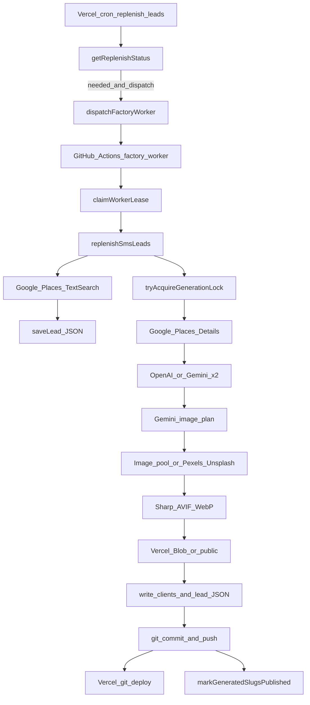

# Factory cost & reliability audit

**Project:** ai-websites (zbrendiraj.si demo factory)  
**Audit date:** 2026-08-31  
**Method:** Read-only code inspection — no behavior changes  
**Scope:** Demo generation pipeline (lead → published demo on production)

**Related docs:**

- [ARCHITECTURE.md](./ARCHITECTURE.md) — system overview and component map
- [ARCHITECTURE-REPORT.md](./ARCHITECTURE-REPORT.md) — detailed implemented behavior
- [WEBSITE-FACTORY-PLAN.md](./WEBSITE-FACTORY-PLAN.md) — factory automation roadmap

**Out of scope for this audit:** Stripe checkout, customer publishing, custom domains, demo lifecycle tracking, admin ops monitoring (`/admin/factory`), SMS outreach architecture. Those systems are referenced only where they border the generation path.

---

## 1. Executive summary

The production demo factory can generate demos at moderate batch sizes (default up to **100 per run**, capped by **80 Places Text Search queries per run**) on **GitHub Actions**, not on Vercel. Generation is **mostly idempotent at the slug level** (DB generation locks, `clientSiteExists`, place-ID dedup), but several gaps can cause **duplicate API spend**, **stuck unpublished demos**, or **overlapping workers** at scale.

**Can it reliably generate hundreds or thousands of demos?**

| Scale | Verdict | Primary constraint |
|-------|---------|-------------------|
| **~100 demos/run** | Achievable with current caps | Discovery search budget (80/run), Gemini serial queue (~4.1s between calls), single git push |
| **Hundreds (500 target backlog)** | Requires many sequential runs | Same caps × run count; no horizontal worker scaling without lease/progress races |
| **Thousands** | Not reliable today | Discovery cost dominates; build/deploy time grows with slug count; reliability gaps compound |

**Top cost drivers (marginal per published demo):**

1. **Google Places Place Details** — 1× per generated demo (~Enterprise SKU; reviews omitted at generation).
2. **LLM calls** — 2× text (OpenAI default) + **1× Gemini image plan always** (even when image pool succeeds).
3. **Places Text Search** — amortized across discovery; can exceed per-demo AI cost when yield is low.
4. **Image pipeline** — low marginal cost when pool hits; Pexels search/download + Sharp + Blob on miss.
5. **Vercel build** — **one per git push**, not per demo (batch amortization).

**Top reliability risks:**

1. **Git push failure after local commit** — locks stay `generated`; retry sees empty porcelain → permanent noop.
2. **Stale `generating` locks** — worker interrupt leaves slug blocked indefinitely (no auto-expire in lock logic).
3. **Lease expiry (90m) vs GHA timeout (360m)** — second worker can start while first still runs.
4. **Manual CLI scripts** bypass generation locks and publish safety.

**Highest-value improvements (see §9–10):** fix push-failure recovery, auto-expire stale locks, lease heartbeat, skip Gemini image plan when pool serves both slots, add API/token metrics to worker runs.

---

## 2. Generation pipeline

### 2.1 Production path

| Step | Module | Output |
|------|--------|--------|
| Trigger | `src/app/api/cron/replenish-leads/route.ts` | Optional GitHub `repository_dispatch` |
| Worker | `src/factory/worker.ts` → `runFactoryWorker()` | Lease, replenish, publish orchestration |
| Discovery | `src/leads/replenish.ts` → `discoverLeads()` | Lead JSON in `src/content/leads/` |
| Generation | `src/clients/create-client-from-lead.ts` → `generateClient()` | `src/content/clients/{slug}/` |
| Publish | `src/factory/publish.ts` → `gitPublishPaths()` | Git commit + push |
| Deploy | Implicit Vercel git integration | Production rebuild |

Vercel cron **does not generate** on ephemeral filesystem — it only reports backlog and optionally dispatches GHA (`FACTORY_DISPATCH_ENABLED`).

### 2.2 Per-site generation sequence (`generateClient`)

File: `src/clients/generate-client.ts`

1. `source.getBusiness()` — **Places Details** (1 HTTP request).
2. `generateBusinessInput()` — **LLM call #1** (+ optional validation retry).
3. `generateSiteConfig()` — **LLM call #2** (+ optional validation retry).
4. Local appearance/theme/layout assignment (no external I/O).
5. `generateSiteImages()` — **Gemini image plan** → pool or stock fetch → Sharp → Blob/local.
6. Atomic write: `business.json`, `site.json`, `saveLead(status: generated)`.

**Partial persistence:** Steps 1–5 side effects (blob, asset cache, pool usage) can persist even if step 6 never runs. Client JSON is all-or-nothing at the end.

### 2.3 Non-production entry points (duplicate-cost risk)

| Entry | Locks | Publish | Notes |
|-------|-------|---------|-------|
| `npm run factory-worker` (GHA) | Worker lease + per-slug | Auto git push | Production path |
| `npm run replenish-leads` | None | Manual | Same discovery + generate |
| `npm run generate-lead` | None | Manual | Single slug |
| `npm run generate-leads` | None | Manual | Batch; fatal errors stop run |

Operators using manual paths can repeat expensive Places + AI calls without `tryAcquireGenerationLock`.

### 2.4 Run caps (defaults)

| Cap | Default | Env / source |
|-----|---------|--------------|
| Demos per replenish run | `min(needed, 100)` | `SMS_LEAD_REPLENISH_BATCH` |
| Places searches per run | 80 | `DISCOVERY_MAX_SEARCHES_PER_RUN` |
| Results per search query | 60 (3×20 pages) | `DISCOVERY_PLACES_LIMIT_PER_QUERY` |
| Worker lease TTL | 90 min | `FACTORY_WORKER_LEASE_MINUTES` |
| GHA job timeout | 360 min | `.github/workflows/factory-worker.yml` |
| Failed lock retry cooldown | 60 min | `FACTORY_GENERATION_RETRY_MINUTES` |
| Actionable backlog target | 500 | `SMS_LEAD_TARGET` |

---

## 3. External API call inventory

For each service: **when**, **calls per published demo**, **cache**, **duplicate on retry**, **retry/timeout/rate-limit**, **failure behavior**, **partial persistence**, **idempotency**, **concurrency**.

### 3.1 Google Places

| Operation | When | Per demo | Cached | Retry | Rate limit | Failure | Partial persist | Idempotent | Concurrency |
|-----------|------|----------|--------|-------|------------|---------|-----------------|------------|-------------|
| **Text Search** | Discovery loop in `replenishSmsLeads` | **Amortized** — up to 80 queries/run, ≤60 results/query | In-run `knownPlaceIds` + slug dedup | **None** | 2s delay between pages only | Exception → query marked complete, loop may break | Lead JSON + Neon discovery progress | Query completion tracked in progress store | Last-write-wins on progress if workers overlap |
| **Place Details** | Each `createClientFromLead` | **1** | No | **None** | None | Throws → slug `failed` lock | None for client JSON | Skipped if `clientSiteExists` | Per-slug lock blocks duplicate gen |

**Field masks:** Discovery uses cheaper `DISCOVERY_FIELD_MASK` (no reviews/hours). Generation uses `GENERATION_DETAILS_FIELD_MASK` (no reviews). Full mask with reviews exists for legacy CLI batch only.

**Files:** `src/sources/google-places-source.ts`, `src/leads/discover.ts`

### 3.2 OpenAI (default text provider)

| When | Per demo | Cached | Retry | Rate limit | Failure | Partial persist | Idempotent |
|------|----------|--------|-------|------------|---------|-----------------|------------|
| `generateBusinessInput`, `generateSiteConfig` | **2** (+1 each on `GenerationContentError`) | No | 1 validation retry per stage | **None** in hot path | Fatal in batch CLI if 429 in message; factory logs per-slug error | None until full `generateClient` completes | Full regen on retry |

**Token usage:** Not recorded. `src/logs/generation-log.ts` logs duration/outcome only.

**Files:** `src/ai/generate-business-input.ts`, `src/ai/generate-site-config.ts`, `src/ai/providers/openai.ts`

### 3.3 Google Gemini

| When | Per demo | Cached | Retry | Rate limit | Failure | Partial persist | Idempotent |
|------|----------|--------|-------|------------|---------|-----------------|------------|
| Text if `AI_PROVIDER=gemini` | **2** (+ validation retries) | No | Same as OpenAI path | Serial queue **4100ms** min interval; 429 up to **3** retries with backoff | Missing key → throw | None until client write | Full regen |
| **Image search plan** (`buildImageSearchPlan`) | **Always 1** — even with `AI_PROVIDER=openai` | No | Via `generateGeminiContent` | Same serial queue | Warn + placeholders if images fail | N/A | Runs **before** pool check |

**Throughput ceiling (single process):** ~3600s / 4.1s ≈ **878 Gemini calls/hour** if every call hits the minimum spacing.

**Files:** `src/ai/gemini-request.ts`, `src/images/build-search-queries.ts`, `src/images/generate-site-images.ts`

### 3.4 Pexels

| When | Per demo | Cached | Retry | Rate limit | Failure | Partial persist | Idempotent |
|------|----------|--------|-------|------------|---------|-----------------|------------|
| Pool fill (`image-pool.ts`) | Amortized category fill | Stock asset cache + blob `stock/pexels/{id}` | 403/429 → 5s wait, **1 retry** | Implicit API limits | Skip candidate | Cache + blob updated during fill | Stock deduped by provider:id |
| Direct fetch (fallback) | 0–2 searches + downloads per demo (hero + services) | Same cache | Same | 1s delay between slots | Incomplete → placeholders | Blob + cache on success | Cache hit skips download + Sharp |

**Files:** `src/images/providers/pexels.ts`, `src/images/download-stock-photo.ts`, `src/images/image-pool.ts`

### 3.5 Unsplash

| When | Per demo | Cached | Retry | Rate limit | Failure | Partial persist | Idempotent |
|------|----------|--------|-------|------------|---------|-----------------|------------|
| Direct fetch fallback only (not pool fill) | 0–2 if Pexels fails | Shared stock cache | 403/429 → 5s, 1 retry | **~45 searches/hour** file-backed (`data/.unsplash-search-times.json`) | Skip | Same as Pexels | File not safe across parallel machines |

**Files:** `src/images/providers/unsplash.ts`, `src/images/unsplash-rate-limit.ts`

### 3.6 Sharp (local)

| When | Per demo | Cached | Failure | Partial persist |
|------|----------|--------|---------|-----------------|
| New stock ingest | 2 slots (hero + services) on cache miss | Optimized bytes stored in blob/local | Throws propagate to image step | Optimized files in blob before client JSON |

**File:** `src/images/optimize-image.ts`

### 3.7 Vercel Blob / local `public/`

| When | Per demo | Cached | Duplicate on retry | Idempotent |
|------|----------|--------|-------------------|------------|
| `storeStockImages` | 0 on cache hit; 2 files (AVIF+WebP) on miss | Stock path keyed by provider:id | Re-upload overwrites (`allowOverwrite: true`) | Yes for stock |
| `storeClientImages` | **4 puts typical** (hero/services × AVIF/WebP) | Per-slug paths | Pool path **re-reads stock + re-uploads** to `clients/{slug}/` | Overwrite allowed |

Attribution metadata (photographer, sourceUrl, provider, sourceId) is stored in `site.json` `images` object — preserved on successful generation.

**File:** `src/images/storage.ts`

### 3.8 Neon (Postgres)

| When | Per demo / run | Idempotent |
|------|----------------|------------|
| `factory_discovery_progress` | Writes after each discovery query | Progress pointer updated incrementally |
| `factory_worker_lease` / `factory_worker_runs` | 1 claim + updates per run | Singleton lease |
| `factory_generation_locks` | ~3–4 updates per slug (generating → generated/failed) | Blocks duplicate generation |
| `demo_lifecycle` | Upsert on lock acquire; publish on git success | Status preserved rules on publish |

**Files:** `src/factory/lease.ts`, `src/factory/generation-lock.ts`, `src/factory/discovery-progress-store.ts`

### 3.9 Git / GitHub

| Operation | When | Per run | Failure behavior | Idempotent |
|-----------|------|---------|------------------|------------|
| `repository_dispatch` | Cron dispatch | 1 | Returns error JSON; no retry | Each dispatch = new workflow |
| `git status/add/commit/push` | End of worker run | 1 push for all demos in run | Commit may succeed, push fail → **stuck state** | No-op if porcelain empty |

**Critical:** `publishGeneratedDemos` uses porcelain **before** commit. If commit succeeds and push fails, next run sees **empty porcelain** → noop while locks remain `generated`.

**Files:** `src/factory/git-publish.ts`, `src/factory/publish.ts`, `src/factory/dispatch.ts`

### 3.10 Vercel deployment

No Deploy Hook or Vercel API in repo. **One git push → one Vercel production build** for all changed content. Build cost/time scales with total slug count in repo, not just batch size.

### 3.11 Not used in demo generation

Resend, Stripe, SMS gateway, inbound webhooks, customer publish workflow, domain APIs.

---

## 4. Estimated cost per demo

**Disclaimer:** Order-of-magnitude estimates for planning. Google Places SKU/billing tier and LLM token counts vary; the codebase does **not** log tokens.

### 4.1 Marginal cost per **published** demo (typical)

| Component | Low case | High case | Notes |
|-----------|----------|-----------|-------|
| Places Details | ~$0.01–0.02 | Same | 1× per demo; Enterprise tier without Atmosphere |
| Places Search (amortized) | ~$0.0002 | ~$0.01 | 80 queries/run ÷ 100 demos vs ÷ 10 demos |
| OpenAI gpt-4.1-mini (2 calls) | ~$0.002–0.008 | ~2× with validation retries | No token telemetry |
| Gemini flash-lite | ~$0.001–0.005 | 3 text + 1 plan if `AI_PROVIDER=gemini` | Image plan always +1 call |
| Pexels / Unsplash | $0 | API time + rate-limit risk | Free tiers |
| Sharp / compute | Negligible | Negligible | GHA runner CPU |
| Blob storage | ~$0.0001/demo cumulative | 4 client objects × N demos | Egress at page views |
| Vercel build | **Amortized per push** | Minutes of build CPU once per batch | Not × demo count |

**Rough marginal total (API-heavy):** ~**$0.02–0.05 per published demo** when pool hit rate is high and discovery yield is good.

**Rough marginal total (worst case):** ~**$0.05–0.15+** with cold pool, direct stock fetch, validation retries, and low discovery conversion (search cost dominates).

### 4.2 Cost per **factory run** (batch)

Example: 100 demos published, 80 discovery queries executed:

- Places Search: up to 80 × (1–3 pages) requests — **largest variable** when many queries return zero actionable leads.
- LLM: 200–400+ text calls + **100 Gemini image plans** minimum.
- Git/Vercel: **1** push + **1** deploy.

### 4.3 Wall-clock drivers (not dollar cost, but throughput)

| Demos in run | Min Gemini spacing alone (3 calls/demo) | Notes |
|--------------|----------------------------------------|-------|
| 1 | ~12s | Plus Places, OpenAI, images |
| 10 | ~2 min | Serial Gemini queue |
| 100 | ~20+ min | Excludes discovery search time, pool fill, git push |

Discovery adds 80 × (API latency + 2s page delays). Pool cold-start for a category can add **10+ Pexels searches** (`INITIAL_FILL=10`, target `POOL_TARGET=30`).

---

## 5. Cache / reuse analysis

### 5.1 What works well

| Mechanism | Location | Effect |
|-----------|----------|--------|
| Stock asset cache | `data/image-asset-cache.json` + blob `stock/{provider}/{id}` | Skips re-download and Sharp on cache hit |
| Image pool | `src/images/image-pool.ts` | Reuses stock assets up to `MAX_IMAGE_USES=40` per asset |
| Place ID dedup | `discoverLeads` in-memory set | Same place not saved twice per run |
| Slug / client exists checks | `clientSiteExists`, `readAllLeads` | Skip regeneration |
| Per-slug generation locks | `factory_generation_locks` | Prevent concurrent duplicate generation |
| Discovery query completion | Neon `factory_discovery_progress` | Avoid repeating exhausted queries |

### 5.2 Gaps — duplicate work and cost

| Gap | Impact | Details |
|-----|--------|---------|
| **Gemini image plan before pool** | 1 wasted Gemini call per demo when pool succeeds | `buildImageSearchPlan` at line 89 of `generate-site-images.ts` runs before `generateImagesFromPool` |
| **Client blob re-upload on pool hit** | 4 Blob puts + read stock URLs per demo | `copyCacheToClient` → `storeClientImages` even when stock unchanged |
| **Failed run side effects** | Orphan blob objects, cache entries, pool usage increments | No rollback on `generateClient` throw |
| **Full pipeline retry** | Repeats Places Details + all LLM on `failed` lock retry after 60m | No checkpoint at business.json |
| **No token/cost metrics** | Cannot optimize or alert on spend | `factory_worker_runs.metrics` JSONB exists but no API counters |
| **Unsplash throttle file** | Race under parallel workers | Local file not coordinated |
| **Manual CLI bypass** | Unlocked duplicate generation | `replenish-leads`, `generate-lead(s)` |

### 5.3 Image pipeline specifics

| Question | Answer |
|----------|--------|
| Same image downloaded twice? | **No** for same provider:id if asset cache hit; **yes** on cache miss or new pool fill |
| Search results cached? | Pexels search results not cached; **ingested assets** cached after first download |
| AVIF/WebP reused? | Stock blobs reused; client copies re-uploaded per slug |
| Blob uploads duplicated? | Stock deduped; client paths always written per assignment |
| Attribution preserved? | Yes in `site.json` when images succeed |
| Detect existing asset before external API? | **Yes** via `getCachedStockAsset` before download |
| Failed processing re-fetch? | Retry of full `generateClient` re-calls Places + AI; image plan runs again; stock cache may prevent re-download |

---

## 6. Failure / retry analysis

### 6.1 Scaled scenarios

| Scenario | Expected behavior | Duplicate cost? | Recovery gap |
|----------|-------------------|-----------------|--------------|
| **1 lead** | 1+ discovery queries, 1 generation, batch push | Minimal | — |
| **10 leads** | Up to 10× marginal API; ~30+ min Gemini spacing at 3 calls/demo | Linear API | — |
| **100 leads** | Hits batch cap 100; may stop earlier at 80 search cap | Discovery may dominate if yield low | Run stops with `global_search_limit` |
| **Interrupted worker** (SIGKILL, GHA cancel) | No SIGTERM handler; lease until expiry; lock may stay `generating` | Partial blobs/cache remain | Stale lock blocks slug forever (ops warning only) |
| **API timeout** | Places: fail query/slug; Gemini: 429 retries; Pexels: 1 retry | Per-slug error in `replenish.errors` | Factory continues |
| **API rate limit** | Gemini throttled + retries; OpenAI/Places unguarded | Factory per-slug continue; batch CLI may abort on fatal message | No global backoff for OpenAI/Places |
| **Git push failure** | Local commit may exist; locks `generated`; not published | **No auto recovery** | Porcelain empty on retry → noop (**critical**) |
| **Partial generation failure** | No client JSON; blobs/cache may exist | Full retry repeats AI + Places | — |
| **Duplicate worker invocation** | Second `claimWorkerLease` → skip | Low if lease held | — |
| **Concurrent workers** | Possible after lease expires (90m) while job runs (360m) | Discovery progress races; duplicate search spend | **Critical** |

### 6.2 Worker circuit breaker

- `countConsecutiveFailures` + `shouldSkipForCooldown`: after **5** failures, skip until **60m** (2× cooldown) unless `--force`.
- Skipped runs do not increment failure streak.
- Publish failure counts as failed run — triggers cooldown.

### 6.3 AI validation retry

`GenerationContentError` triggers **one** retry per stage with correction prompt appended. Malformed JSON/schema can therefore **double** LLM cost for that stage (max 4 text calls instead of 2).

---

## 7. Concurrency / idempotency analysis

### 7.1 Safe mechanisms

| Mechanism | Behavior |
|-----------|----------|
| GHA `concurrency: factory-worker` | Queued runs; `cancel-in-progress: false` |
| Singleton worker lease | One non-expired lease holder |
| Per-slug lock states | `generating` → `generated` → `published`; `published` always blocks |
| Same-run lock re-entry | Same `run_id` can re-acquire `generating` |
| `clientSiteExists` | Skip generation if site on disk |
| Git publish noop | No empty commit when no changes |

### 7.2 Unsafe or partial

| Gap | Risk |
|-----|------|
| No lease heartbeat | Overlap after 90m |
| `generating` never auto-expires | Permanent slug block |
| Commit-then-push failure | Stuck unpublished |
| Discovery progress last-write-wins | Race corrupts pointer |
| Blob writes not tied to publish | Orphan storage |
| Manual scripts | No locks |
| `demo_lifecycle` set to `generated` at lock acquire | Before generation completes |

---

## 8. Scaling risks

1. **Discovery economics** — Fixed 80 searches/run regardless of conversion; low-yield regions burn Places budget.
2. **Gemini serial bottleneck** — Single-process queue caps throughput (~850 calls/hour).
3. **Mandatory image plan** — 100% of demos pay Gemini even at full pool utilization.
4. **Single git push chokepoint** — One failure blocks entire batch lifecycle update.
5. **Lease vs job duration mismatch** — 90m vs 360m enables overlapping workers.
6. **Pool cold start** — New profession categories trigger Pexels fill burst.
7. **Vercel build time** — Thousands of `generateStaticParams` slugs increase build minutes (separate from generation API cost).
8. **No horizontal scaling story** — Second worker needs partitioned discovery + distributed locks; not implemented.
9. **Neon write volume** — Modest at hundreds of demos; not a primary bottleneck.

---

## 9. Highest-value optimizations

Each recommendation: **impact**, **complexity**, **effect** (cost / reliability / both).

| # | Recommendation | Impact | Complexity | Effect |
|---|----------------|--------|------------|--------|
| 1 | **Fix git push failure recovery** — detect ahead commits and push, or track publish-pending separately from porcelain | HIGH | Medium | Reliability |
| 2 | **Auto-expire stale `generating` locks** after `FACTORY_GENERATION_RETRY_MINUTES` (same as failed retry window) | HIGH | Low | Reliability |
| 3 | **Lease heartbeat / extend TTL** while worker run is active | HIGH | Medium | Reliability |
| 4 | **Skip Gemini image plan when pool can serve hero + services** — check pool before `buildImageSearchPlan` | HIGH | Low | Cost + latency (both) |
| 5 | **Add API call + token counters** to `factory_worker_runs.metrics` | MEDIUM | Medium | Cost observability |
| 6 | **Dispatch dedupe** — skip GitHub dispatch when active worker lease exists | MEDIUM | Low | Reliability |
| 7 | **Blob client alias** — reference stock URLs in `site.json` without re-upload on pool assign | MEDIUM | Medium | Cost |
| 8 | **OpenAI + Places rate-limit wrappers** (mirror Gemini serial queue) | MEDIUM | Medium | Reliability |
| 9 | **Generation checkpoint** — skip Places Details if valid `business.json` exists for retry | MEDIUM | High | Cost on retry |
| 10 | **Discovery yield tuning** — reduce searches when combo zero-yield streak high | LOW | Medium | Cost |

---

## 10. Recommended implementation order

Priority: **reliability blockers first**, then **cost wins**, then **observability**.

| Phase | Items | Rationale |
|-------|-------|-----------|
| **1 — Unblock publishing** | #1 git push recovery, #2 stale lock expiry, #3 lease heartbeat | Demos generated but not live = wasted spend |
| **2 — Reduce waste** | #4 skip redundant Gemini plan, #6 dispatch dedupe | Immediate API savings and fewer overlapping runs |
| **3 — Observability** | #5 metrics in worker runs | Measure before further optimization |
| **4 — Cost polish** | #7 blob alias, #8 rate limits, #9 checkpoint | Lower marginal cost at scale |
| **5 — Discovery efficiency** | #10 yield tuning | Lower amortized Places cost |

**Do not implement in this audit** — recommendations are documentation only until explicitly scheduled.

---

## Appendix A — Key source files

| Concern | Path |
|---------|------|
| Worker orchestration | `src/factory/worker.ts` |
| Replenish loop | `src/leads/replenish.ts` |
| Discovery | `src/leads/discover.ts` |
| Client generation | `src/clients/generate-client.ts` |
| Image orchestration | `src/images/generate-site-images.ts` |
| Image pool | `src/images/image-pool.ts` |
| Stock download + cache | `src/images/download-stock-photo.ts` |
| Gemini throttle | `src/ai/gemini-request.ts` |
| Generation locks | `src/factory/generation-lock.ts` |
| Git publish | `src/factory/git-publish.ts`, `src/factory/publish.ts` |
| GHA workflow | `.github/workflows/factory-worker.yml` |
| Factory tests | `scripts/test-factory-worker.ts` |

## Appendix B — Manual verification

Claims in this document were cross-checked against the codebase on 2026-08-31. Factory worker invariant tests (`npm run test-factory-worker`) validate cooldown, lock blocking, and publish-failure semantics without live API calls.
