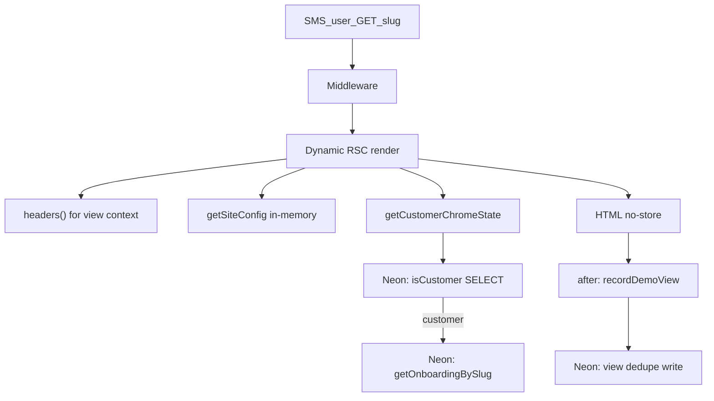
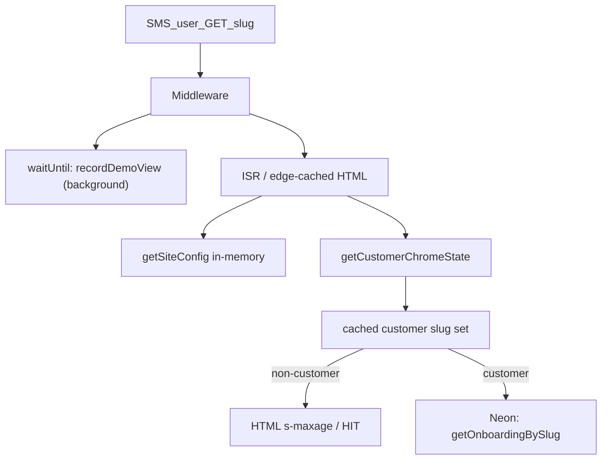

# Performance audit — zbrendiraj.si

> **Measured:** 2026-09-01 (baseline) · **Fixes implemented:** 2026-09-01  
> **Scope:** Demo `/{slug}` SMS traffic (primary), legal subpages, product pages.  
> **Related:** [ARCHITECTURE.md](./ARCHITECTURE.md) · [FACTORY-COST-RELIABILITY-AUDIT.md](./FACTORY-COST-RELIABILITY-AUDIT.md)

---

## Executive summary

Demo pages at `/{slug}` were **fully dynamic** on every SMS click: no Vercel edge cache, a Neon round-trip on render, and synchronous `headers()` during RSC render for view tracking. Warm TTFB was ~350–400ms.

**Three root causes:**

1. **No HTML caching** — `export const dynamic = "force-dynamic"` plus `headers()` in `[slug]/page.tsx` forced `Cache-Control: private, no-cache, no-store` and perpetual `x-vercel-cache: MISS`.
2. **Neon on every page view** — `getCustomerChromeState` → `isCustomer(slug)` ran `SELECT` for all 370+ demo slugs even though customers are rare.
3. **View tracking blocked static HTML** — `recordDemoView` was correctly deferred via `after()`, but `headers()` was read synchronously during render.

**Fixes applied (Phases A + B):**

| Phase | Change | Expected impact |
|-------|--------|-----------------|
| A | Cached customer slug set (`unstable_cache`, 60s) + short-circuit in `getCustomerChromeState`; `revalidateTag` on Stripe purchase | Remove Neon from demo render path (~100–250ms TTFB) |
| B | Move view tracking to middleware `waitUntil`; remove `force-dynamic` / `headers()` / `after()` from page; `revalidate = 300` ISR | Edge-cacheable HTML; warm TTFB &lt;100ms on repeat visits |

---

## 1. Metrics baseline (pre-fix)

| Signal | Value | Source |
|--------|-------|--------|
| Client slugs | **378** | `src/content/clients/` |
| Build static paths | **2271** (legal subpages × slugs) | `npm run build` |
| Build time | ~10s total; SSG phase ~2.8s | local `npm run build` |
| Main demo route `/[slug]` | **Dynamic (ƒ)** despite `generateStaticParams` | build output |
| Legal subpages (`/piskotki`, etc.) | **SSG (●)** | build output |
| Production `Cache-Control` | `private, no-cache, no-store` | `curl -I` on demo URLs |
| `x-vercel-cache` | **MISS** on every request | `curl -I` |
| Warm TTFB (HEAD) | ~**350–400ms** demo/product | `curl` to production |
| Root `/` first hit | ~6s (likely cold start) | single sample |

**Note:** Vercel Analytics / Speed Insights were not available for this audit; production curl and local build output are the primary signals.

---

## 2. Traffic context

| Route class | Volume driver | Pre-fix behavior |
|-------------|---------------|------------------|
| `/{slug}` demo | SMS outreach clicks | Dynamic render + Neon + no cache |
| `/{slug}/piskotki` etc. | Legal/footer links | SSG (already fast) |
| `/` product | Marketing | Separate route |
| `/admin/*` | Internal ops | Auth-gated; out of scope |

SMS users overwhelmingly hit `GET /{slug}` once per message; repeat clicks within a session benefit most from edge HTML cache.

---

## 3. Regression timeline

| Commit | Date | Change | Effect |
|--------|------|--------|--------|
| `b869594` | 2026-08-30 | `export const dynamic = "force-dynamic"` on `[slug]/page.tsx` | Fixed customer chrome during SSG; disabled all HTML caching |
| `ed13f03` | 2026-08-30+ | `headers()` + `after(recordDemoView)` for demo lifecycle | View tracking correct but `headers()` also forces dynamic rendering |

---

## 4. Request path (before)



---

## 5. Bottleneck detail

### 5.1 No HTML caching (HIGH)

`src/app/[slug]/page.tsx` had `export const dynamic = "force-dynamic"` and synchronous `headers()` for `extractViewContext`. Next.js treats both as dynamic signals; production responded with `no-store` and `x-vercel-cache: MISS`.

### 5.2 Neon on every demo view (HIGH)

`src/app/site-page.tsx` → `getCustomerChromeState` → `isCustomer(slug)` queried Postgres for every slug. `getCustomerSlugSet()` existed but was unused on the public render path.

### 5.3 View tracking kept route dynamic (MEDIUM)

`recordDemoView` in `after()` did not block TTFB, but reading `headers()` during render prevented static/ISR HTML generation.

### 5.4 Secondary factors (lower priority)

| Factor | Impact | Notes |
|--------|--------|-------|
| Build scale (2271 SSG paths) | Build/deploy | Legal pages already static |
| Middleware on all paths | Low | Simple rewrite/redirect |
| Hero images via Blob AVIF/WebP | LCP | Pre-optimized; bypasses Next optimizer by design |
| `DemoPurchaseBar` client JS | Low | Loads after paint |
| `opengraph-image` dynamic | Low | Social crawlers only |

---

## 6. Implemented fixes

### Phase A — Cached customer slug set

**Files:** `src/customers/slug-cache.ts`, `src/onboarding/customer-chrome.ts`, `src/app/api/webhooks/stripe/route.ts`

- `getCachedCustomerSlugSet()` via `unstable_cache` (60s TTL, tag `customer-slugs`).
- `getCustomerChromeState`: if slug ∉ cached set → return non-customer state without DB.
- `revalidateTag("customer-slugs")` after successful Stripe checkout / upsell upsert.

**Risk:** LOW — up to 60s before new customer sees onboarding chrome bar; acceptable for rare purchases.

### Phase B — Cacheable demo HTML + middleware view tracking

**Files:** `src/app/[slug]/page.tsx`, `src/middleware.ts`, `src/demo-lifecycle/middleware-demo-view.ts`

- Removed `force-dynamic`, `headers()`, `after()`, and page-level `recordDemoView`.
- Added `export const revalidate = 300` (5-minute ISR).
- Middleware: on `GET` for `/{slug}` or `/demo/{slug}`, `event.waitUntil(scheduleDemoViewFromRequest(...))` — non-blocking Neon write in background.
- `recordDemoView` still uses `isCustomer()` directly (Edge-safe; runs only in `waitUntil`, not on render path).

**Risk:** MEDIUM — view counts must remain accurate; covered by `npm run test-demo-lifecycle`.

---

## 7. Request path (after)



---

## 8. Verification

### Local (post-fix, 2026-09-01)

```bash
npm run build                    # /[slug] no longer ƒ (was Dynamic before fix)
npm run test-demo-lifecycle      # 28/28 checks passed
```

**Build route table:** `/[slug]` moved from **ƒ Dynamic** to ISR/static generation (no `ƒ` marker; `revalidate = 300`). Legal subpages remain **● SSG**.

### Production (after deploy)

```bash
# Run twice — second request should show HIT when edge cache warm
curl -sI "https://zbrendiraj.si/{demo-slug}" | rg -i "cache-control|x-vercel-cache"
curl -sI -o /dev/null -w "ttfb:%{time_starttransfer}s\n" "https://zbrendiraj.si/{demo-slug}"
```

**Pre-deploy baseline (still live):** `cache-control: private, no-cache, no-store`, `x-vercel-cache: MISS`, TTFB ~309ms (`frizer-janez` sample).

| Check | Before | After deploy (expected) |
|-------|--------|-------------------------|
| `x-vercel-cache` | MISS | HIT on repeat |
| `Cache-Control` | `no-store` | `s-maxage` / public ISR |
| Demo TTFB (warm) | ~350–400ms | &lt;100ms edge HIT |
| Neon on demo render | Every request | None (non-customers) |
| `npm run test-demo-lifecycle` | — | **Passed** (local) |

Record actual post-deploy numbers in this table when verified on production.

---

## 9. Prioritized fix list

| Priority | Fix | Status | Impact |
|----------|-----|--------|--------|
| P0 | Cached customer slug set; skip Neon for demos | **Done** | HIGH |
| P0 | Remove `force-dynamic` + `headers()`; ISR demo HTML | **Done** | HIGH |
| P0 | Middleware `waitUntil` view tracking | **Done** | HIGH (enables P0 cache) |
| P1 | `revalidateTag` on Stripe purchase | **Done** | LOW staleness |
| P2 | `next/image` priority on hero LCP | Open | MEDIUM |
| P2 | Reduce legal-page `generateStaticParams` explosion | Open | Build only |
| P2 | Vercel Speed Insights | Open | Observability |
| P3 | PPR static shell + dynamic chrome hole | Open | HIGH long-term |

---

## 10. Explicit non-goals

- Stripe checkout flow, SMS gateway, factory worker, customer git publish, custom domains
- Removing demo view tracking
- Admin page performance
